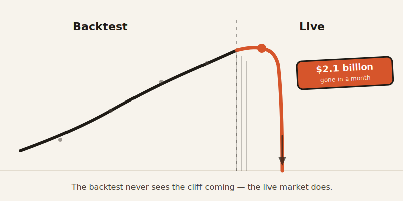
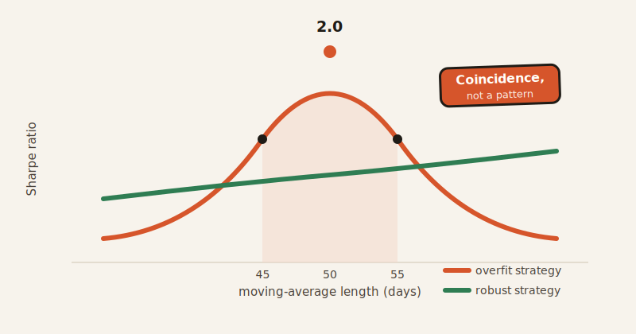

import CompareCard from '../../components/CompareCard.astro';

Two Nobel Prize winners built a trading model. Its backtest looked flawless. Then it lost $2.1 billion in a single month.

## Replaying the game after you already know the score

Picture a sports commentator, the Monday after a big game, explaining exactly why the winning team's every move was brilliant. Of course it looks brilliant — he's watching the replay with the final score already in his head. In real time, on the field, none of it was obvious. Half the "genius" calls were coin flips that happened to land right.

Backtesting is that same replay, done to a stock chart instead of a football game. You already know what the market did. Any strategy that would have caught the big moves looks like genius, because you built it while staring at the answer key. The question a backtest can never actually answer is the only one that matters: would it have worked *before* you knew how the story ended?

## The model that could not lose — until it did

In the 1990s, a hedge fund called Long-Term Capital Management ran trading models designed by two Nobel Prize–winning economists. The models were sophisticated, and their backtests looked outstanding. Then, in August 1998, markets started doing things they had never done in the historical data the models were built on. The fund lost 44% of investor money — $2.1 billion — in that one month.

The models weren't broken. They were just built entirely from the past, and the past is not a contract about the future.

## The trick that fools even careful people: overfitting

Here's the mechanism, in miniature. Say you're testing a strategy that buys when a stock crosses its 50-day moving average. You try 50 days, and the backtest gives you a great Sharpe ratio of 2.0. Nice. Then, just to check, you try 45 days and 55 days instead — and performance collapses.

That collapse is the tell. A real, robust strategy degrades gracefully as you nudge its settings. One that cliff-dives the moment you change a number by 5 days wasn't finding a pattern in the market. It was finding a coincidence in the data and calling it a pattern.

## Counting only the stocks that lived to tell the tale

Most backtests run on today's list of stocks — the ones still around to be tested. That quietly deletes every company that went bankrupt, got delisted, or merged away. A dataset covering the last 10 years in North America can leave out up to 75% of the stocks that actually existed and traded during that period.

This isn't a rounding error. One study comparing survivorship-biased data against a complete dataset from 1926–2001 found annualized returns of 9.0% versus 7.4%. That 1.6-point gap compounds for decades. In sharper cases, a strategy that looks like it returns 15% a year can drop to 8% once the companies that died are put back in the picture.

## Reading tomorrow's newspaper by accident

Look-ahead bias is subtler and easy to miss: using information in a backtest that wasn't actually available yet on the date being tested. A classic version — plugging in a company's year-end financial results as if they were known in December, when in reality they weren't published until February. The backtest "knows" things the trader, on that actual day, could not have known. Naturally, it performs beautifully. It's cheating, just by accident.

## Testing until something wins

Now stack on the biggest one: what if, instead of one strategy, you test a million?

Researchers ran the numbers on 2.1 million trading strategies. Once the results were corrected for the fact that testing that many strategies will turn up lucky winners by pure chance, genuinely profitable strategies turned out to be rare. Test enough random noise and some of it will look like a pattern — the same way flipping a coin a million times guarantees a run of twenty heads in a row that means nothing.

The industry's own behavior gives this away. About 65% of institutional traders now run Monte Carlo simulations — shuffling the order of historical trades to see if the strategy still holds up. And "walk-forward testing," splitting data into chunks and testing on each separately, is treated as the gold standard of due diligence. Both are, functionally, admissions that ordinary backtests can't be trusted on their own — so the industry built a second layer of testing just to catch the first layer's lies.

## The costs that vanish in a backtest but not in your account

Backtests love to assume you buy and sell at exactly the price you wanted, instantly, for free. Real markets charge you for both.

Slippage — the gap between the price you expected and the price you actually got — can run from about 0.1% in a liquid market up to 1.5% or more in a thin one. Run the math on a strategy that backtests to a +2% annual return with 0.5% average slippage, and you're left with -0.5%. The slippage didn't just eat the profit. It ate the profit and then some.

## The paradox: the prettier it looks, the more it's probably lying

This is the part that trips people up, because it's backwards from instinct. A gorgeous backtest doesn't mean you found something. It usually means you found a way to fool yourself especially well.

<CompareCard
  caption="None of these numbers survive contact with a live market for long. That's exactly why they're red flags."
  rows={[
    { term: "Sharpe ratio", meaning: "Good = about 0.75 · Red flag = above 1.5 · Basically fiction = above 3.0" },
    { term: "Profit factor", meaning: "Realistic = 1.2–2.0 · Red flag = above 2.0 · Basically fiction = above 4.0" },
    { term: "Annual return", meaning: "Red flag = absurdly high, every year, without fail" },
  ]}
/>

There's a name for the feeling that produces this: hindsight confidence. It's the financial version of holding this week's winning lottery ticket and telling everyone you predicted the numbers. The outcome is already known. Of course it feels certain.

## So why does almost everyone still believe it?

An estimated 95% of traders fail — and mostly not because their strategy was bad on paper. Execution variance (slippage, timing, real-world messiness) accounts for roughly 60–70% of that failure, and shifting market conditions another 15%. The strategy itself is often the smallest part of the problem. But the backtest is what convinces people they've found an edge, right before the market shows them otherwise.

Real accounts confirm it: in 2024, 77% of retail trading accounts on eToro closed at a net loss. Somewhere behind most of those accounts was a backtest that looked great.

The two Nobel Prize winners had the best backtest money could build. It didn't know what the market hadn't done yet. Neither does yours.
