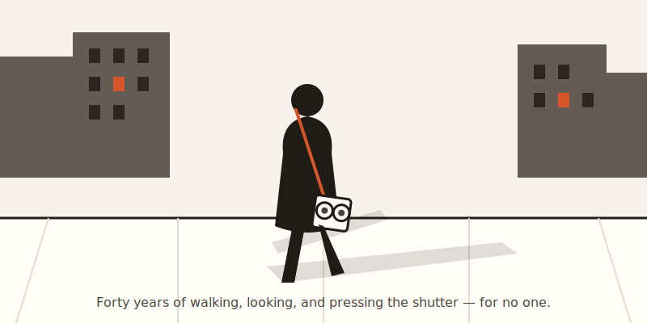
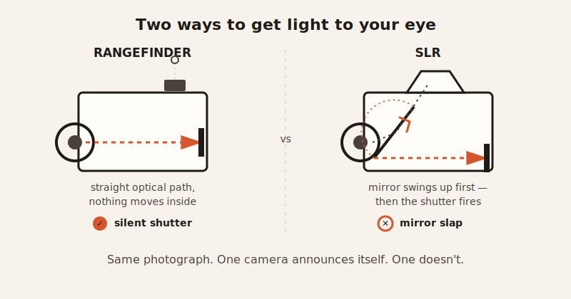

import CompareCard from '../../components/CompareCard.astro';

Vivian Maier took more than 150,000 photographs during her lifetime. She showed none of them to anyone.

For 40 years she worked as a nanny in Chicago. On her days off, she walked the city with a camera around her neck and photographed strangers — a woman laughing on a stoop, a kid mid-jump, a businessman's shadow stretched long across the pavement. Then she went home, and the film sat in boxes. She never printed most of it. She never told the families she worked for. Nobody knew.

In 2007 her storage unit went to auction. Three collectors bought the contents, not knowing what was inside. When the negatives went online in 2009, they went viral. Critics started calling her one of the great street photographers of the 20th century. She was 82, and for the first time, people were showing *her* pictures back to her. She died a few months later.

That order of events breaks the usual assumption about art: that it needs an audience to count. Maier photographed for four decades with an audience of zero and never once seemed to need one. The walking and looking and shooting was the whole point. The recognition, when it came, was almost beside the question.

So what was she actually doing out there, camera in hand, that was worth doing for nobody? That's the interesting part — and it starts with a decision that sounds backwards: throwing away all the color.

## Color is a crutch. Black and white takes it away.

Here's a fast way to test a photo: strip the color out and see if it still works. A green field and a blue sky can carry a mediocre photo — the colors themselves are pretty, so nobody notices there was no real composition underneath. Take the color away and that safety net is gone. All that's left is light, shadow, contrast, and shape. If those aren't doing real work, the photo falls apart.

That's why black and white rewards attention to *lines* — the edge of a sidewalk, the diagonal cut of a shadow, a row of windows — and to *layering*, meaning something interesting happening in the foreground, something else in the middle distance, and something else again behind that. Color photography lets your eye drift to whatever's brightest or most saturated. Black and white has nowhere for your eye to hide, so it goes straight to composition, the same way a silent instant replay makes you notice footwork you missed while the commentator was talking over it.

## The moment doesn't wait for you to be ready

Street photography runs on what Henri Cartier-Bresson called the decisive moment: the split second when everything in the frame — a gesture, a shadow, a stranger's expression — lines up at once. Blink and it's gone. There's no do-over, no asking the stranger to walk past again. It rewards a strange combination of patience and twitch reflexes: you can stand in one spot for twenty minutes waiting for the frame to fill itself in, and then have about a quarter of a second to actually press the shutter.

The camera that came to define this kind of shooting was built to get out of its own way.

## The camera that announced nothing

The Leica M3, made from 1954 to 1966, sold around 250,000 units and became the tool of choice for a generation of street photographers. The reason wasn't the lens. It was that the shutter was almost silent, the body weighed only 610 grams, and the rangefinder design meant there was no mirror slapping around inside like there is in an SLR. You could raise it, frame a stranger mid-stride, and fire, and the camera gave up almost nothing. No moment scared off by a click.

That quietness mattered because it solved half the decisive-moment problem: the camera wasn't the thing tipping the stranger off that they were being photographed. The other half of the problem — exposure — had no camera-shaped fix. It came down to the photographer knowing the light before the meter did.

## Why the light meter lies to you in black and white

A camera's light meter is built to find a middle-gray average across the frame. In color, that's usually close enough. In black and white, it can be wrong in a way that costs you the shot, because the meter has no idea which tones in the frame actually matter — it just averages everything into mush.

Street photographers dealt with this two ways. First, by metering off one specific patch of the scene — a shaded wall, a sidewalk — instead of trusting the average. Second, by underexposing on purpose, often by a full stop: better to lose a little shadow detail, which can be recovered later, than to blow out a highlight, which can't be recovered at all once it's pure white.

And when there was no meter at all, there was still a rule that worked: on a sunny day, set the aperture to f/16 and the shutter speed to match the film's ISO number — ISO 100 film, 1/125th of a second. Nicknamed Sunny 16, it worked because direct sunlight is one of the few light sources predictable enough to guess correctly, decade after decade, without any electronics at all.

## The film debate that never actually resolves

Once exposure was sorted, there was still the question of what film to load. Two black-and-white stocks have anchored that argument for decades, and neither one wins.

<CompareCard
  rows={[
    { term: "Kodak Tri-X 400", meaning: "High contrast, punchy grain, an unmistakable look. Thrives in harsh, dramatic light and pushes well to higher ISO. The classic street-photography stock." },
    { term: "Ilford HP5 Plus 400", meaning: "About 2 stops more exposure latitude than Tri-X, softer tonality, holds onto shadow detail even when pushed. Forgives a badly-metered shot Tri-X wouldn't." }
  ]}
  caption="Most working photographers just keep both loaded and pick per situation — which is its own answer."
/>

Tri-X for a photo that needs bite. HP5 for a photo shot in bad light with no time to think it through. Neither stock is "better" — they just fail differently, and knowing which failure you can live with is most of the decision.

## The paradox nobody solves: invisible until you press the button

Here's the joke buried at the center of all of this. Every street photographer talks about wanting to disappear — to blend into the crowd so the moment stays unposed and honest. And then they lift a camera to their eye, which is one of the most conspicuous gestures a human body can make in public. You cannot vanish and hold a camera up to your face at the same time. The tool that captures the honest moment is also the thing most likely to end it.

Some photographers respond by trying to get faster and sneakier. Others give up on invisibility entirely and go the opposite direction — shooting openly, making eye contact, being upfront that they're taking a photo, and trusting that honesty reads differently than a hidden lens ever could. Neither approach makes the camera disappear. They're just two different ways of living with the fact that it won't.

Maier, as far as anyone can tell, didn't spend much energy solving that paradox either way. She just kept walking, kept looking, kept pressing the shutter — for nobody, for forty years, until a storage unit auction made the choice to show her work for her.
