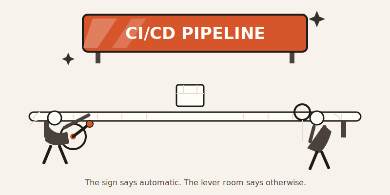
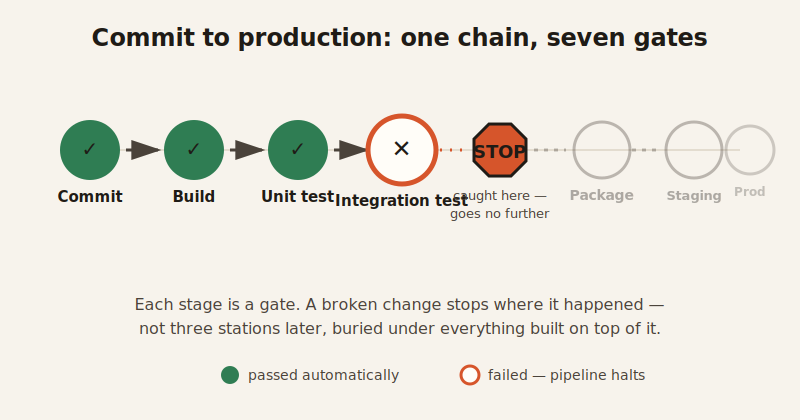

import CompareCard from '../../components/CompareCard.astro';

Only one company in a hundred has actually finished the journey from "developer hits commit" to "code is live for customers" without a human touching anything in between.

## Everyone says yes. Almost nobody means it.

Ask engineering teams if they do CI/CD, and 53% will say yes to continuous integration. That number drops to 38% for continuous delivery. It drops again to 29% for continuous deployment. And when you ask who has automated the *entire* path — commit to production, no manual gate anywhere — the number is 1%.

That's not four versions of the same yes. Those are three different, increasingly demanding claims, and most teams are answering "yes" to the easy one while quietly meaning the hard one. The term has been stretched so far that it barely means anything anymore — a team that auto-runs tests but still deploys by someone clicking a button on a Friday afternoon will still tell you, with a straight face, "oh yeah, we're CI/CD."

## What the words actually mean

Before the gap makes sense, the words need pinning down — because CI, CD, and "CI/CD" as a vague vibe are three different things wearing the same T-shirt.

- **Continuous Integration (CI)**: every time someone merges code, a build and a test suite kick off automatically. Instead of finding out three weeks later that two people's changes don't get along, you find out in minutes.
- **Continuous Delivery (CD)**: the codebase is *always* in a state that could ship. All the quality gates pass automatically. A human still decides when to actually release it — but the "is it ready" question is already answered.
- **Continuous Deployment**: the most demanding of the three. Every change that passes the checks goes live automatically, no human decides "should we ship this." High-performing teams that do this can deploy many times a day.

Think of it like an assembly line with an inspector at every station instead of one inspector at the very end. A raw part (a code commit) moves down the line through automated checkpoints. If something's wrong, it gets caught at the station where it happened — not three stations later, buried under everything built on top of it. The workers get told immediately, while the problem is still small and still theirs to fix.

<CompareCard
  caption="Three names, three different levels of 'automatic.'"
  rows={[
    { term: "Continuous Integration", meaning: "Build + test run automatically after every merge" },
    { term: "Continuous Delivery", meaning: "Always release-ready; a human still presses go" },
    { term: "Continuous Deployment", meaning: "Passes checks → live, automatically, no human gate" },
  ]}
/>

## The pipeline, one stage at a time

A full pipeline is a chain of checkpoints, and code has to survive all of them: commit, then build, then unit test, then integration test, then package, then deploy to a staging copy of the app, then — finally — deploy to production. Each stage is a gate. Fail one, and the code stops there instead of sneaking further downstream.

The entire point of stacking that many gates is speed of feedback. Manual testing might tell a developer about a bug days later, after they've mentally moved on to something else entirely. An automated pipeline tells them in minutes, while the change is still fresh in their head. Small changes, caught fast, are easy to fix. Big changes, caught slow, are archaeology.

## Why most pipelines stall out halfway

If the idea is this good, why does only 1% of the industry actually finish it? Because the parts in between look automated and aren't quite trustworthy yet.

Take flaky tests — tests that pass sometimes and fail other times for no real reason. They're not a minor annoyance: they eat up 16–24% of developers' time, because someone has to stop and investigate every failure to check whether it's a real bug or just the test being moody again. The tempting fix is to just retry the test until it passes. That's the retry paradox: hitting retry doesn't fix anything, it just hides the flakiness under the rug, so the pipeline *looks* trustworthy while quietly becoming less so. A test nobody trusts is worse than no test, because it still costs you the time without paying back the confidence.

There's a name for what happens next: **CI apathy**. Builds break, nobody fixes them right away, workarounds become routine, and eventually the team stops treating a red pipeline as an emergency. Once that mindset sets in, it doesn't stay contained to testing — low standards have a way of spreading to everything else.

And even a pipeline that technically works can quietly sabotage a workday. A 45-minute build leaves a developer with two bad options: sit and stare at a progress bar, losing focus, or switch to something else and fragment their attention across two problems at once. Neither one is actually fine.

## What it costs when the gates fail anyway

None of this is free to get wrong. Teams report losing up to 30% of the workday to CI and code-review friction. Even just one lost hour a day adds up: for a 20-person team, that's roughly $1 million a year once you count salary, lost focus, and delayed features.

And that's the cost of a *slow* pipeline. A pipeline that lets something broken slip all the way to production is a different bill entirely: enterprise downtime runs about $5,600 a minute on average, and at least one documented CI/CD failure cost a company $200,000 in lost revenue from a single bad release. The whole reason the gates exist is to make that bill someone else's problem — the automated pipeline's, not production's.

## Older than it looks, rarer than it should be

Here's the part that stings a little: this isn't a new idea teams haven't caught up to yet. The practice traces back to 1989 with an environment called Infuse, and Continuous Integration was formally proposed in 1991 by Grady Booch. Extreme Programming picked it up in 1996 and pushed something that still sounds aggressive today — multiple integrations *per day*.

Thirty years later, that's still considered elite. Not standard. Not "the bar." Elite. An idea that's older than a lot of people currently writing pipelines for a living, and the finished version of it is still something only 1 in 100 companies can actually claim.

## The short version

"We do CI/CD" is doing a lot of quiet work as a sentence. It usually means "we auto-run tests," sometimes means "we could ship anytime," and almost never means "code ships itself with nobody touching a button." The gates in between — flaky tests nobody trusts, builds nobody rushes to fix, retries that paper over real problems — are exactly what keeps 99% of teams stuck on "partial" instead of "finished." The pipeline isn't hard to understand. It's hard to actually trust all the way through.
