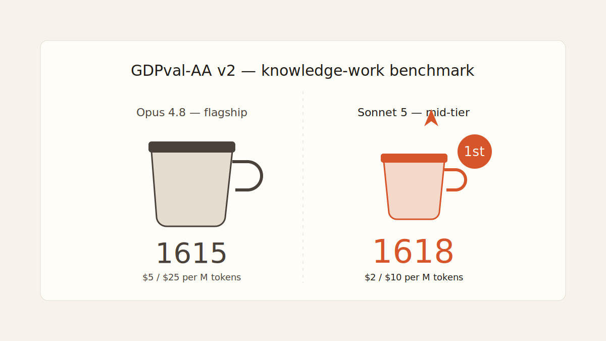
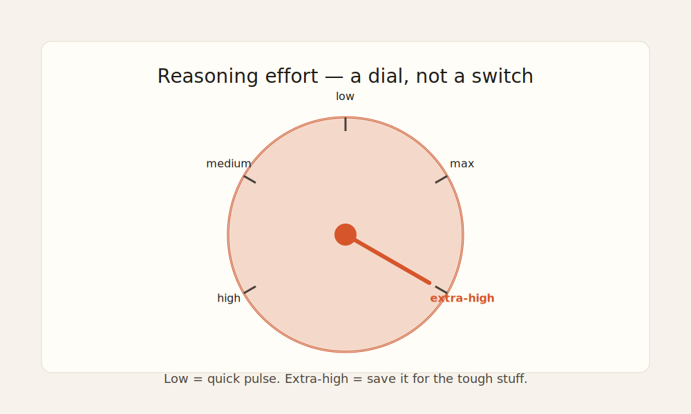

import CompareCard from '../../components/CompareCard.astro';

## The scoreboard that shouldn't happen

Anthropic makes a few sizes of AI model, like a coffee shop menu: small, medium, large. The large one, called Opus, is the expensive flagship. The medium one, called Sonnet, is supposed to be the sensible everyday choice — cheaper, a little less capable.

On June 30, 2026, Anthropic released the newest medium one: **Claude Sonnet 5**. And on a benchmark that measures real knowledge-work tasks (GDPval-AA v2), it scored **1618**. The expensive flagship, Opus 4.8, scored **1615**.

The medium coffee just out-tasted the large one. And it costs less than half as much per cup.

## Wait, what's a "benchmark," and why does 3 points matter?

Think of a benchmark like a driving test for AI models. You give a bunch of models the exact same set of tasks — writing code, reading a contract, answering tricky questions — and see who does best. The score is just "percentage of tasks done well."

Three points isn't a landslide. But it's not the direction anyone expected. Flagship models are supposed to win, full stop — that's what "flagship" means. A cheaper sibling catching up on price is normal. Catching up on *quality*, on any benchmark at all, is the twist.

## What actually changed under the hood

Three things, in plain terms:

**1. It can think longer, on command.** Sonnet 5 lets you dial in how hard it thinks before answering — low, medium, high, max, or "extra high." It's a blender speed dial. Low is a quick pulse for something easy. Extra high is the setting you save for the tough stuff. Thinking harder costs more time and money, so now you choose per-task instead of always paying for maximum effort.

**2. It can read a lot more at once, for the same price.** Sonnet 5 can take in 1 million tokens of text in one go — roughly a very long novel — and, unusually, it doesn't charge more for using all of it. Older long-context models used to charge a surcharge once you fed them a huge amount of text. Sonnet 5 charges the same flat rate whether you send it a paragraph or an entire codebase.

**3. It's built to *do* things, not just answer questions.** Anthropic is pitching Sonnet 5 as its most "agentic" Sonnet yet — meaning it's meant to plan multi-step tasks, click around in a browser, and run in a terminal mostly unsupervised, rather than just reply to one question and stop.

## The price tag

<CompareCard
  caption="Same company, two tiers — the gap is bigger in price than in results."
  rows={[
    { term: "Input / output cost", meaning: "Sonnet 5: $2 / $10 per million tokens · Opus 4.8: $5 / $25 per million tokens" },
    { term: "Knowledge-work benchmark (GDPval-AA v2)", meaning: "Sonnet 5: 1618 · Opus 4.8: 1615" },
    { term: "Coding (SWE-Bench Verified)", meaning: "Sonnet 5: 85.2%" },
    { term: "Long-context pricing", meaning: "Sonnet 5: no surcharge · older tiers: extra cost past a threshold" },
  ]}
/>

The $2/$10 rate is an introductory price through August 31, 2026 — it rises to $3/$15 after that. Even at the higher rate, it's still under half of Opus's price per token.

## What this looks like in practice

- **A giant code review.** A 1M-token review of an entire codebase — the kind that used to trigger a long-context surcharge — now costs the same flat rate as a two-sentence prompt.
- **Finding things on the web.** In a benchmark for autonomous web browsing (BrowseComp), Sonnet 5 hit 84.7% working alone and 86.6% when a team of these models split up the work — going out, clicking through pages, and verifying facts largely without hand-holding.
- **Real GitHub-style bugs.** On SWE-Bench Pro, a harder version of the coding test built from real GitHub issues, Sonnet 5 jumped to 63.2% — a meaningful climb from the previous Sonnet generation.

## The funniest part

Early access testers reported something quietly hilarious: Sonnet 5 started checking its own answers and correcting itself **without being asked to**. Nobody told it to double-check its homework. It just started doing it.

Combine that with a literal dial that goes up to a setting called "extra," and you've basically built an AI with main character energy — grading its own work, and occasionally deciding today's a five-gears day.

## The honest takeaway

"Cheaper" and "worse" aren't the same word, even though we treat them that way out of habit. Sonnet 5 doesn't beat Opus everywhere — Opus is still the flagship for a reason. But it closed the gap enough, on enough things, that "just use the expensive one to be safe" stopped being an automatic answer. Sometimes the sensible middle option turns out to be the smart one, not just the cheap one.
