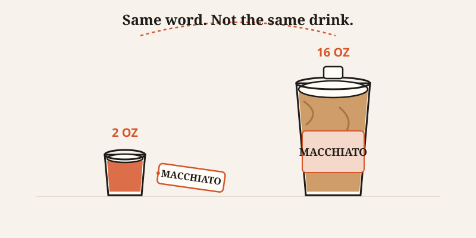
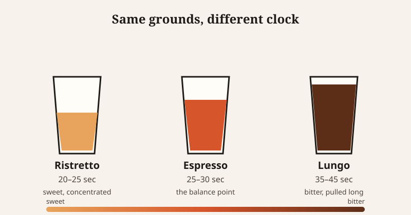

import CompareCard from '../../components/CompareCard.astro';

A traditional espresso macchiato is a shot of espresso with a dab of milk foam on top — 2 to 3 ounces, total. Order a Caramel Macchiato at Starbucks and you get 12 to 16 ounces of milk and caramel syrup with barely a whisper of foam in it. Same name. Not the same drink. Not even close.

## Nobody is lying to you. There's just no rulebook.

Here's the thing that makes this extra confusing: no barista is trying to trick you. There is no official coffee dictionary that Starbucks broke and your local café follows correctly. The Specialty Coffee Association — the closest thing the industry has to a rulebook — only updated its core evaluation standards in 2024, after 20 years of using the same form. Even the professionals are still arguing about how to measure this stuff. If the experts can't agree, the guy behind the counter definitely didn't get a memo.

So drink names drifted. Different shops, different countries, different decades, all doing their own thing with the same handful of Italian words.

## Blame one guy, a little bit

In 1983, Starbucks CEO Howard Schultz visited Italian espresso bars and fell in love with the culture — the language, the ritual, the whole vibe. He came home wanting to recreate it, so he brought the words with him: macchiato, latte, grande. He succeeded at building an empire on that vocabulary. He just didn't keep the *meanings* attached.

"Grande" means "large" in Italian. At Starbucks, it's the medium — Tall (12 oz) is smaller, Venti (20 oz, Italian for "twenty") is bigger. Starbucks even used to sell a "Short," which was the actual smallest size. They quietly dropped it from the menu, and Tall — quietly — became the new smallest size on the board, without the word changing at all. The names didn't get simpler. They got better at making a medium feel like a splurge.

Traditional Italian cafés, meanwhile, just serve a 6-ounce cappuccino and call it a day.

## The word "cappuccino" doesn't point at one drink anymore

Try this: ask for a cappuccino in three different places and picture what shows up.

- **In Italy**, it's espresso topped with steamed milk and foam in roughly equal parts — the "rule of thirds" — and you'd only order it before about 11 a.m. Asking for one after lunch marks you as a tourist, the coffee equivalent of ordering a full breakfast at a dinner service.
- **At Starbucks**, it's espresso plus 8 to 10 ounces of steamed milk — which is closer to a latte wearing a cappuccino's name tag.
- **At a specialty coffee shop**, it's built on a 1:2 ratio — a double shot plus 2 ounces of milk, deliberately smaller and stronger than either of the above.

Three drinks. One word. All of them correct, according to whoever's making it.

## Why the *milk* is doing more work than you think

The espresso underneath most of these drinks barely changes. What actually separates a macchiato from a cappuccino from a latte is how much milk gets added, and in what form.

<CompareCard
  caption="Same double shot of espresso underneath every one of these."
  rows={[
    { term: "Macchiato", meaning: "1:1 ratio · about 1 oz milk · dry foam, sits on top" },
    { term: "Cappuccino", meaning: "1:2 ratio · about 2 oz milk · microfoam, velvety, mixed in" },
    { term: "Latte", meaning: "1:3 to 1:4 ratio · 3–4 oz milk · thin foam layer, mostly steamed milk" },
  ]}
/>

Dry foam sits on top like a lid — light, airy, mostly air. Microfoam is different: it's steamed into the milk itself, silky instead of foamy, and it changes the entire texture of the drink in your mouth. Two drinks can use the exact same espresso and still taste nothing alike, because the milk was steamed for a different job.

## The part that actually changes the flavor: time

None of that milk math matters if the espresso underneath is wrong, and that comes down to something almost nobody watches — how long the water touches the grounds.

Think of it like steeping a tea bag. Ten seconds in hot water gives you something bright and sweet. Leave that same bag in for three minutes and it turns bitter and harsh. Same tea bag, same water, completely different drink, just because of time.

Espresso works the same way. Different flavor compounds dissolve out of the grounds at different speeds — sweetness and acidity come first, bitterness comes later — so how long the water runs through decides what you taste:

- **Ristretto**: 20–25 seconds. Short pull, sweeter, more concentrated.
- **Espresso**: 25–30 seconds. The balance point.
- **Lungo**: 35–45 seconds. Longer pull, more bitterness pulled out along with everything else.

That's before anyone's even added milk. The extraction time sets the flavor; the milk ratio sets the format. Two separate decisions, both hiding under one drink name.

## It gets weirder once you leave the counter

Cross a border and the vocabulary resets entirely. Vienna has the Wiener Melange — roughly half coffee, half steamed cream. Austria also has the Einspänner: black coffee under a dome of whipped cream, no milk at all. Australia and New Zealand have spent decades arguing over which of them invented the flat white in the 1980s (two shots of espresso, microfoam milk, thinner than a cappuccino) — nobody has ever settled it, and probably nobody will.

And if you walk into a café across most of Europe and ask for "regular coffee," you'll get a confused look. There isn't a "regular." Bottomless drip coffee is an American thing — the default in Italy, Spain, and Austria is espresso, full stop.

## So what do you actually do with this?

Honestly? Stop trusting the name and start describing the drink. "A double shot with about an ounce of foamed milk" will get you the same thing in Rome, Seattle, and your local café — a word like "macchiato" won't, because it's been claimed by too many different drinks already. The name was never the specification. It was just whatever the last shop decided to call it.
