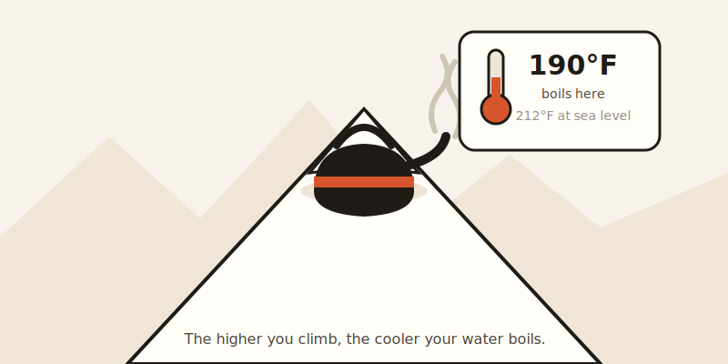
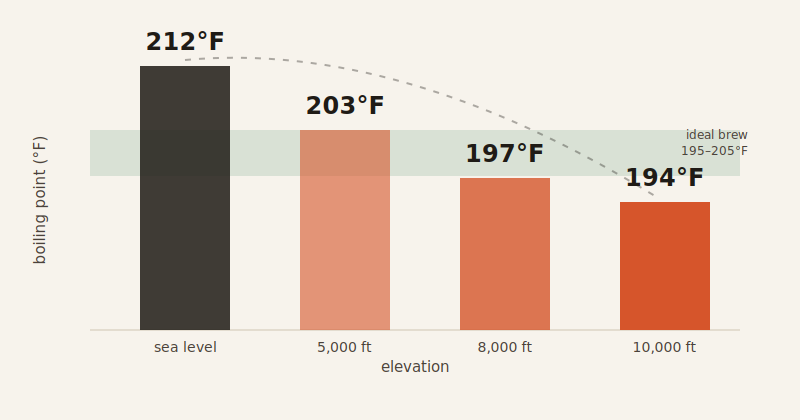

In Vail, Colorado, water boils at around 190°F — nearly 20 degrees cooler than at sea level — and that's exactly cold enough to ruin your coffee.

## The recipe didn't change. The air did.

Say you've got your pour-over dialed in perfectly at home in, say, Boston. Same beans, same grind, same ratio, same timer, every morning. Then you move to Denver. You make the exact same cup, down to the second. It comes out sour, thin, and weirdly hollow.

You didn't do anything differently. The water did.

## Why altitude steals your coffee's heat

Water boils at a lower temperature the higher up you go. At sea level, it's 212°F. Climb to 5,000 feet — Denver's elevation — and it only reaches about 203°F. At 8,000 feet, it tops out around 197°F. At 10,000 feet, it's just 194°F.

That's not a small difference. It's the same reason eggs take longer to hard-boil in the mountains than at the beach: the water isn't hot enough to transfer heat efficiently, whether you're cooking an egg or extracting flavor from coffee grounds.

## What "under-extracted" actually means

Coffee needs heat to pull the good stuff out of the grounds — somewhere between 18% and 22% of the bean's dry mass should dissolve into your cup for it to taste balanced. The ideal water temperature for that is 195–205°F. At altitude, that window shrinks. Sometimes it disappears entirely.

Here's the part that explains the sour taste: organic acids extract first, early in the brewing cycle. Sugars and deeper flavor compounds come later. If your water isn't hot enough to keep the extraction going long enough, you're left with a cup that's mostly acid — sour, sharp, and thin. That's under-extraction, and cooler water makes it almost unavoidable.

## Real places, real numbers

- **Denver, Colorado (5,280 ft):** Water boils around 203°F. Local coffee shops compensate by grinding finer or brewing 15–30 seconds longer than sea-level recipes call for.
- **Vail, Colorado (8,150 ft):** Water boils at 190–195°F, roughly 20 degrees below sea level. One barista tested pour-over and French press during a busy powder-day rush — without adjusting for altitude, the cups lost sweetness and body within minutes.
- **La Paz, Bolivia (12,500 ft):** The world's highest national capital. Ironically, the coffee grown at nearby high altitudes — the Caranavi region, 1,400–2,000 meters up — is prized as specialty-grade, because slower, cooler ripening concentrates flavor in the bean. But brew that same coffee in La Paz itself, and you're fighting water that struggles to reach 190°F.

The plant likes altitude. The kettle does not.

## The one brewer that gets *better* up there

Here's the twist: not every brewing method loses to altitude. Pour-over and French press rely entirely on water temperature to do the extracting, so when the water runs cold, they just... underperform.

The AeroPress doesn't play by the same rules. Because you physically push the water through the grounds with pressure, it doesn't depend on heat alone to force extraction — the pressure does some of that work instead. The result is strange but real: an AeroPress can perform *better* at altitude than it does at sea level, while pour-over and French press quietly get worse.

So if you're brewing above 5,000 feet, the "worse" gadget at your parents' sea-level kitchen might be the best one in your cabinet.

## What to actually do about it

You can't make your kettle boil hotter — that's just physics, not a setting on your stove. But you can compensate:

- **Grind finer.** More surface area means more contact time with the water you've got, squeezing out extraction the temperature alone can't.
- **Brew longer.** Denver cafés add 15–30 seconds to sea-level times for exactly this reason.
- **Reach for the AeroPress.** If you're above 8,000 feet and your pour-over keeps coming out sour, pressure extraction is doing you a favor that gravity extraction can't.

None of this is a flaw in your technique. Your recipe was never wrong — it just assumed water that gets hotter than the mountains will allow.
