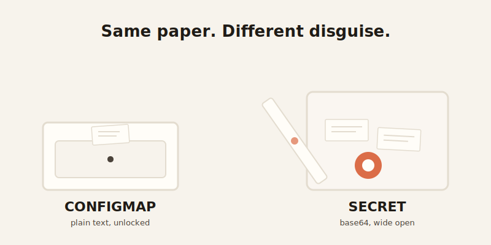

import CompareCard from '../../components/CompareCard.astro';

A healthcare company's Kubernetes field named "Secret" just cost them $2.3 million — and the field was never actually secret.

## Two boxes, one big misunderstanding

Kubernetes gives you two places to store settings for your app: **ConfigMaps** and **Secrets**. A ConfigMap is like a restaurant's menu taped to the wall — anyone can read it, and if something changes, you reprint it. A Secret is supposed to be like the safe in the back office, holding cash and card numbers, locked up tight.

Here's the problem. A lot of restaurants just hide the safe behind a curtain and hope nobody looks. That's what a default Kubernetes Secret is. It looks locked. It isn't.

## What's actually different (and what isn't)

A ConfigMap stores your data as plain, readable text. A Secret stores it as base64 — a block of scrambled-looking characters. That sounds like security. It is not.

**Base64 is encoding, not encryption.** Encoding just rewrites data in a different alphabet so machines can pass it around safely — it was never designed to keep anyone out. Anyone with the string can decode it back to the original in one command, no password required. It's the digital version of writing your PIN backwards and calling it a vault.

Both ConfigMaps and Secrets store their data in the same place under the hood: etcd, the cluster's central database. Same storage, same plumbing — just one of them wears a disguise.

<CompareCard
  rows={[
    { term: "Holds", meaning: "ConfigMap: plain settings · Secret: sensitive data" },
    { term: "Stored as", meaning: "ConfigMap: readable text · Secret: base64 (not encrypted)" },
    { term: "Backing store", meaning: "Both: etcd" },
    { term: "Size limit", meaning: "Both: 1 MiB" },
    { term: "Encrypted at rest?", meaning: "Neither, unless you turn it on yourself" },
  ]}
  caption="Same shape, same plumbing — very different amount of protection."
/>

## Why there's a 1 MiB ceiling on both

ConfigMaps and Secrets both cap out at 1 MiB. That number isn't arbitrary — it's because etcd's own default request size limit is 1.5 MiB, and Kubernetes leaves headroom below that for metadata. The limit exists to protect the whole cluster: without it, one oversized write could bloat etcd or eat through the API server's memory.

## Encryption is opt-in, not automatic

This is the part that surprises people: by default, Secrets sit in etcd completely unencrypted. Anyone with access to etcd, or to the API server, can decode them as easily as reading a text file. If you want real encryption, you have to turn it on yourself — by setting up an `EncryptionConfiguration` with a KMS provider (AWS KMS and Google Cloud KMS are the ones typically recommended). Kubernetes doesn't do this for you. It just quietly assumes you will.

That gap between what the name "Secret" implies and what it actually does is exactly where things go wrong.

## Updating one doesn't always work the way you'd guess

If you mount a ConfigMap or Secret into a pod as a **file** (a volume), it updates on its own — the kubelet notices the change and syncs it in, usually within one to two minutes.

If you inject it as an **environment variable** instead, nothing updates automatically. The pod has to restart before it sees the new value. Same rule for both ConfigMaps and Secrets — the delivery method decides whether "updating the config" actually does anything until you restart.

At large scale, there's also an `immutable: true` setting for both. Marking a ConfigMap or Secret immutable tells the kubelet to stop watching it for changes entirely, which cuts real load off the API server — useful once you're running thousands of pods that would otherwise all be polling for updates that were never coming.

## When the base64 illusion meets real money

**A healthcare company** exposed patient database credentials through Secrets that were only base64-encoded, never encrypted. Nobody noticed for eight months. The result: a $2.3 million HIPAA fine, on top of legal costs and the kind of reputation damage that doesn't show up on an invoice.

**A fintech startup** left payment processor API keys exposed through an improperly secured Kubernetes dashboard. Attackers used them to run up $180,000 in fraudulent transactions before anyone caught it. The payment processor terminated the startup's account — they lost the ability to process payments at all for three weeks while they scrambled to switch providers.

**A Series B startup** had AWS credentials committed to a public GitHub repo — checked in as part of a ConfigMap, not even a Secret, which is its own kind of mistake. By the time someone noticed, an attacker had already spun up crypto-mining instances on their account. The AWS bill hit $40,000 in 18 hours.

## The pattern behind all three

None of these companies got hacked by anything exotic. They got hacked because a Secret looked secure and wasn't, and nobody closed that gap before someone else found it. It's an easy mistake to inherit, too — copy a working ConfigMap YAML, rename it to `kind: Secret`, and it's tempting to assume the security came along for the ride. The API doesn't care. The plumbing is identical either way. Only the encryption you bother to add makes it different.
