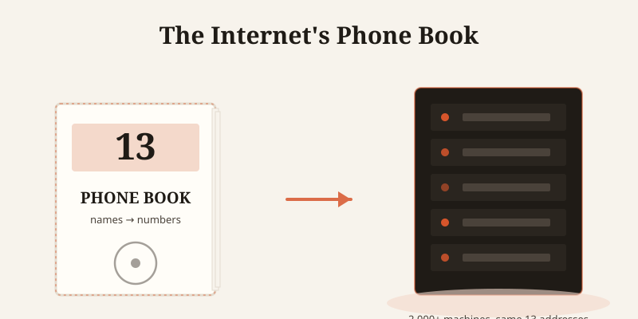
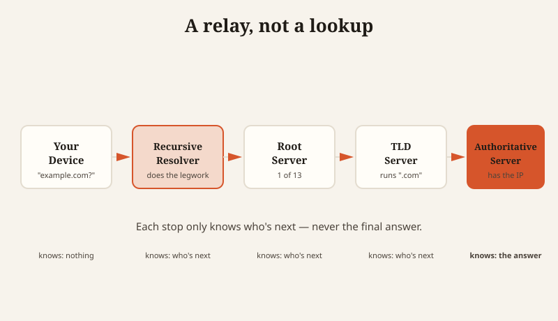

There are only 13 root servers holding up the entire internet's address book, and the reason there aren't 14 is a decades-old size limit on a single data packet.

## It's just a phone book

Here's the whole idea, before any of the jargon: you type "example.com" into your browser. Computers don't actually know that address — they only know numbers, like 192.0.2.1. Something, somewhere, has to look up the name and hand back the number. That something is DNS, the Domain Name System. It's the internet's phone book: you look up a name, you get a number back.

Every single time you visit a website, your device is quietly making that same call in the background — "what's the number for example.com?" — before it can load a single pixel.

## The four-stop relay race

A DNS lookup isn't one lookup. It's a relay, and each runner only knows where to find the *next* runner, not the final answer.

1. Your device asks a **recursive resolver** — the one assigned to do the legwork for you.
2. The resolver asks a **root server**, which doesn't know the answer either, but knows exactly who does.
3. The root server points to a **TLD server** — the office in charge of every ".com" name, if that's what you're looking for.
4. The TLD server points to the **authoritative server** — the one that actually holds the real IP address.

Nobody in this chain knows the whole answer except the last stop. Each server's only job is to know who to hand you off to next. That division of labor is why this system can handle the entire internet without collapsing under its own weight.

## Why the answer is only 13

Here's the number the opening line promised. There are exactly 13 root server *identities*, named A through M. That's it — not 14, not 20.

The reason is almost funny: back in the 1980s, DNS answers had to fit inside a single 512-byte data packet, because that was the size limit of the format being used at the time. Engineers worked out that 13 was the most root server addresses they could cram into that space. The internet has grown by roughly a billion times since then, and that 1980s packet-size decision is still the reason the number sits at 13 today.

It sounds fragile — 13 servers holding up the whole internet — but each of those 13 *identities* is actually run from over 2,000 physical machines scattered around the planet, all quietly answering to the same 13 addresses. So the number never changed, but what's standing behind it quietly did.

## Fast answers get remembered — for a while

Nobody wants to run that whole four-stop relay every time they load a page, so DNS answers get cached with a timer attached, called a TTL (Time-to-Live). It just means "remember this answer for this many seconds before asking again." Typical TTLs run anywhere from 5 minutes to a full day.

Chrome, amusingly, doesn't even bother reading that timer properly — it caches every DNS answer for exactly 60 seconds no matter what the server asked for, simply because of how the underlying system calls it uses are built. The instructions say "remember this for an hour," and Chrome shrugs and forgets it after one minute anyway.

## Built to be unbreakable. Getting more breakable anyway.

DNS was designed so that no single company or server could ever be a single point of failure — that was the whole point of spreading the job across root servers, TLD servers, and authoritative servers instead of one giant database.

But in practice, most people never touch that design. They just use whatever DNS resolver their phone or router defaults to, and increasingly, that default is one of a handful of giant providers — Google's 8.8.8.8, or Cloudflare. Google Public DNS runs on "anycast," meaning many servers worldwide quietly share that one address, and your device gets routed to whichever one is closest.

Convenient, fast, encrypted, all good things. But it also means that when one of those giants has a bad day, it doesn't matter that the website you're trying to reach is running fine — if the phone book you're using goes quiet, you can't find the number, and neither can millions of other people using the same default. The system was built to have no weak point. Economic convenience quietly built one anyway.

## The trust problem nobody fixed

There's an even older weakness baked into the original design: DNS, by default, has no way to verify that an answer is genuine. It just trusts whoever responds first. An attacker who can slip in a forged answer before the real one arrives can redirect you to a fake server without your browser ever knowing something's wrong — a trick called DNS spoofing, and it's over 40 years old and still works.

A fix exists — DNSSEC, which adds cryptographic signatures so answers can be verified instead of just trusted — but as of 2025 it's only deployed on about a quarter of the internet's top-level domains. The lock exists. Most of the doors just don't have one installed.

## The internet's silliest corner

DNS takes itself extremely seriously right up until it doesn't. Someone once registered a chain of hosts purely so that tracing the network route to `bad.horse` spells out the lyrics of a song, line by line, hop by hop — a joke that required real infrastructure and somehow still works today.

It gets more absurd: Google, OpenDNS, and Akamai all let you query a specially crafted address and get *your own* public IP address handed back in the DNS response — a system built to look up other computers, repurposed to ask "hey, what am I?"

And then there's the domains themselves. Nothing in DNS cares about word boundaries, which is how the internet ended up with real, working, technically legitimate domains like penisland.com and whorepresents.com. The system that quietly routes 380+ billion queries a day for .com and .net alone has absolutely no sense of humor about it — the humor is entirely an accident of how humans read words without spaces.

DNS never announces itself. No app icon, no notification, no "thanks for using me" message. It just answers the same question, billions of times a day, and gets out of the way before you notice it was ever there.
