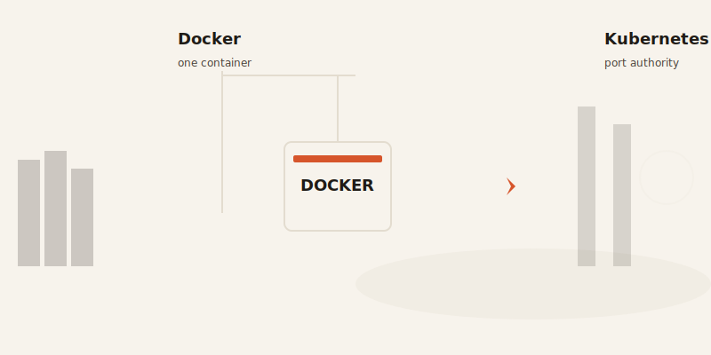
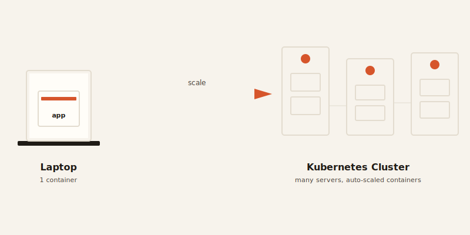

import CompareCard from '../../components/CompareCard.astro';

## Everyone thinks it's Docker *or* Kubernetes

It's not. Almost every team that uses Kubernetes also uses Docker — they're not rivals, they're a relay team. Docker builds the box. Kubernetes runs a whole port full of them.

## Docker: the shipping container

Imagine mailing a package. You don't want the courier to care what's inside — fragile electronics, a cake, a stack of books — you just want it to survive the truck, the weather, and every warehouse it passes through.

That's what Docker does for software. It seals your app *and* everything it needs (code, libraries, settings) into one sealed box called a **container**. Build that box once, and it runs identically on your laptop, your coworker's laptop, and a server on the other side of the planet. "It works on my machine" stops being an excuse — the machine travels with the code.

Docker containers are also fast: about half a second to start, because they're just an isolated slice of one computer. Nothing more.

## Kubernetes: the port authority

Now imagine you're not shipping one box. You're running an entire port — thousands of containers, across hundreds of machines, and none of it can wait for a human to personally direct every crane.

That's Kubernetes. It doesn't build containers — Docker already did that part. Kubernetes decides where each container runs, restarts it if the machine under it dies, and adds more of them automatically when traffic spikes. It costs a little speed for that coordination: a Kubernetes pod takes 1.5–3 seconds to get scheduled, versus Docker's half-second, because there's a whole control room deciding where it goes first.

**Spotify** runs this at a scale that's hard to picture: 600 million users, 4,000 microservices, spread across roughly 200 Kubernetes clusters. **Reddit** moved its front page, comments, and voting onto Kubernetes (via AWS's EKS) specifically so a crashed server stops being a page-you-at-2am incident — the cluster just quietly restarts the affected piece and moves on.

## Side by side

<CompareCard
  caption="One packs the cargo. The other runs the port."
  rows={[
    { term: "What it is", meaning: "Docker = container runtime · Kubernetes = container orchestrator" },
    { term: "Scale", meaning: "Docker = one machine · Kubernetes = a whole cluster of machines" },
    { term: "Start time", meaning: "Docker ≈ 0.5 sec · Kubernetes ≈ 1.5–3 sec (it's scheduling, not just starting)" },
    { term: "Who needs whom", meaning: "Kubernetes needs a container runtime · Docker doesn't need Kubernetes" },
    { term: "Best for", meaning: "Docker = building & running locally · Kubernetes = running at production scale" },
  ]}
/>

## "Isn't Kubernetes overkill for small teams?"

The conventional wisdom says yes — you need a small army of DevOps engineers just to babysit it, so leave it to the giants. That's mostly outdated. Single-node Kubernetes (tools like k3s or minikube) gives a small team the same production-grade tooling on their own laptop, which kills the "works here, breaks in prod" trap before it starts. And managed Kubernetes (AWS's EKS, Google's GKE) hands you the cluster as a service — you pay for compute, not for a team to run the plumbing. Starting with that discipline early is often cheaper than bolting orchestration on after you've already outgrown a pile of shell scripts.

## The part that's actually a little funny

Docker bet on its own orchestrator, **Docker Swarm**, as the simple, built-in alternative to Kubernetes. It was lighter, easier to set up — and it still exists today. Almost nobody runs it in production anymore. Kubernetes won because, once a team's needs got serious (multi-cloud, security policies, deep observability), Swarm didn't have the features to keep up. Convenience loses to capability once the requirements grow up.

Kubernetes has its own moment of irony too. For years, the standard complaint was "you need a whole engineer just to install this thing." Kubernetes' response, in a recent release, was: simpler resource definitions, easier multi-cluster management, less YAML to babysit. The infrastructure equivalent of "we heard you're overwhelmed — here's slightly friendlier paperwork."

## So which do you actually pick?

Wrong question, but here's the honest version: if you're one developer building an app, you need Docker — full stop. Kubernetes for a single app is like hiring a port authority to move one box. Once that app is running across many machines, needs to survive crashes on its own, and has to scale with traffic without you SSH-ing in at midnight, that's when Kubernetes starts paying for itself. Most projects meet Docker on day one and only meet Kubernetes later, if ever — and that's not a failure, it's just the cargo getting bigger than the box.
