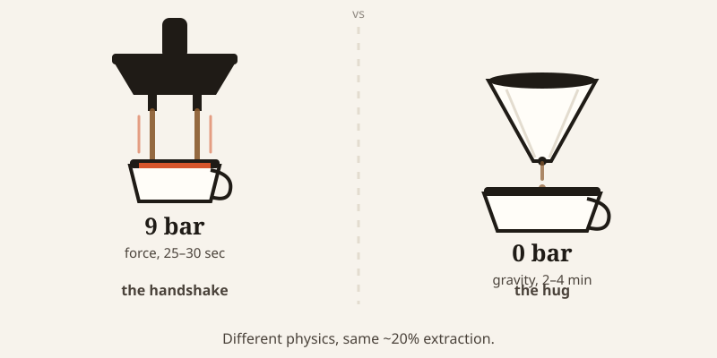
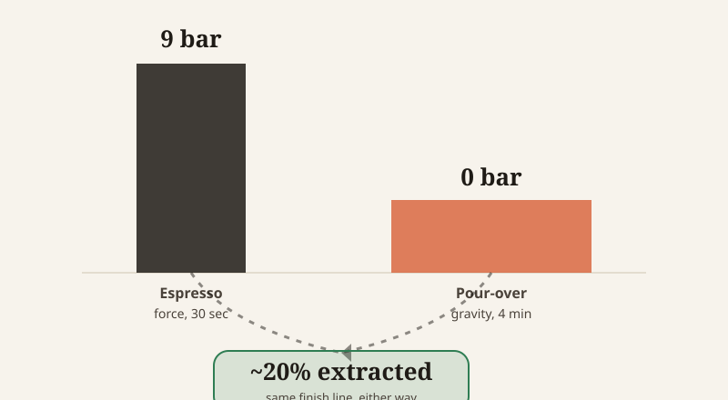

import CompareCard from '../../components/CompareCard.astro';

An espresso shot finishes before you've had time to sit down. A pour-over is still dripping after you've checked your phone twice. And yet, chemically, they land in almost the exact same place.

## A quick squeeze vs a long, patient soak

Picture two ways of saying hello. One is a firm two-second handshake — squeeze and let go. The other is a long, unhurried hug that lasts a few minutes. Both convey the same amount of warmth. They just get there differently.

That's espresso and pour-over. Espresso is the handshake: water forced through the grounds at high pressure for 25–30 seconds, done. Pour-over is the hug: water trickles through by gravity alone for 2–4 minutes, starting with a 30–45 second "bloom" where the grounds just sit and puff up before the real pour even begins.

## Why pressure gets away with rushing

Here's the part that shouldn't work. Espresso's 25–30 seconds is five to ten times faster than pour-over's 2–4 minutes. Despite that gap, both methods pull out roughly the same percentage of the coffee — about 20%, give or take 2 points. A 25-second blast of pressure accomplishes what four patient minutes of gravity also accomplish. Longer soak time doesn't mean more flavor pulled out. The two methods are just taking different-shaped paths to the same finish line.

The reason is the pressure itself. Espresso machines force water through the grounds at 9 bar — about 900 kilopascals, roughly nine times the pressure of the air around you. That pressure speeds up how fast flavor compounds and dissolved CO₂ move out of the grounds and into the water. Pour-over has none of that. Zero bar, all gravity. It makes up the speed difference with time instead of force.

That squeeze produces a side effect gravity brewing can't: crema, the tan foam sitting on top of a shot. Under 9 bar, dissolved CO₂ gas gets forced to stay suspended in the liquid. The moment the pressure's gone — cup in hand, back to atmospheric pressure — the gas escapes as tiny bubbles. Pour-over never builds that pressure in the first place, so the CO₂ just bubbles away during brewing instead of showing up as foam later.

The other price of speed is grind size. To extract as much as it does in under 30 seconds, espresso needs grounds ground almost to powder — more surface area lets water pull flavor out fast. Pour-over uses a coarser, medium grind; anything finer would clog the filter or over-extract during those long minutes of contact.

Even the water temperature reflects the time crunch. Espresso comes out of the machine at about 88°C and lands in the cup around 67°C; pour-over runs hotter, 91–96°C. That sounds backwards — shouldn't the fast method use hotter water? But hotter water speeds up extraction too, and espresso is already extracting fast under pressure. Stack more heat on top of that pressure and the short 25-second window turns into over-extraction — bitter, burnt-tasting coffee — before you've even finished pulling the shot.

## Same finish line, different roads

<CompareCard
  caption="Two completely different physics setups, landing at nearly the same extraction."
  rows={[
    { term: "Force", meaning: "Espresso: 9 bar pressure · Pour-over: 0 bar, gravity only" },
    { term: "Contact time", meaning: "Espresso: 25–30 sec · Pour-over: 2–4 min (plus a 30–45 sec bloom)" },
    { term: "Water temp", meaning: "Espresso: ~88°C, cup ~67°C · Pour-over: 91–96°C" },
    { term: "Grind", meaning: "Espresso: near-powder fine · Pour-over: medium-coarse" },
    { term: "Extraction yield", meaning: "Both: ~20% ± 2%" },
  ]}
/>

Where the two really part ways is concentration. Espresso finishes 10 to 15 times more concentrated than drip-style pour-over. A single 30-milliliter shot carries roughly as much dissolved coffee as a 300-milliliter pour-over cup — same extraction percentage, just a tenth of the water carrying it.

## The devices that split the difference

Not everything sits neatly on one end of this spectrum.

The **Moka pot** lands in the middle: 1–2 bar of pressure, a fraction of espresso's 9 bar, producing coffee with roughly 3–4% dissolved solids — weaker than espresso, stronger than drip. It's espresso's technique, borrowed at a much smaller scale.

**Turkish coffee** skips the middle ground entirely and does something neither espresso nor pour-over does: no filter at all. Grounds go in at 75–125 microns — nearly powder — boiled directly in a small pot called a cezve, pulled off the heat to build froth, and brought back to a boil, two or three times total. The grounds stay suspended in the cup instead of getting filtered out.

On the pour-over side, the standard is the **Hario V60**, a cone-shaped dripper introduced in 2004 that won a Japanese Good Design Award in 2007. Its defining feature isn't the 60-degree cone angle everyone notices — it's the single large hole at the bottom. Older drippers used small holes that throttled the flow by themselves. The V60's big hole hands that control entirely to the person pouring: pour fast, water moves fast; pour slow, it lingers. Ribs run up the inside walls so the paper filter doesn't seal flat against the ceramic and choke things off.

## One more variable: what's between the grounds and your cup

Paper filters strip out diterpenes — oily compounds called cafestol and kahweol — which is part of why paper-filtered pour-over tastes cleaner and fruitier, with less body. Cloth or mesh filters, like the ones in a cezve or a Moka pot, let those oils straight through, which is part of why that coffee tastes richer and heavier, if a little cloudier.

## Physics doesn't explain everything

Not every coffee habit here is about extraction chemistry.

The percolator is the outlier of gravity brewing: instead of running water through the grounds once, it recirculates already-brewed coffee back through them, over and over. There's no mechanism to stop extraction — only the stove's heat dial. Leave it perking too long and it just keeps getting more bitter, with no natural end point.

The Moka pot has its own tell: a gurgling sound as steam bubbles push through the emptying lower chamber. That gurgle is the pot telling you to take it off the heat — mechanically useful, and also just a nice thing for a coffee pot to do.

Turkish coffee's two-or-three-boil ritual, on the other hand, is pure ceremony. Extraction is already finished after the first boil; boiling again doesn't pull out more flavor, it only builds foam. Generations have still argued over whether two boils or three make better coffee — a debate with no physics in it at all.

## So which one should you use

Neither is more correct. They're a handshake and a hug arriving at the same 20%, just by different physics. Espresso spends 9 bar of force to get there in half a minute; pour-over spends four unhurried minutes and skips the force entirely. Pick the one that matches how much time you actually have. The coffee doesn't care which one you choose.
