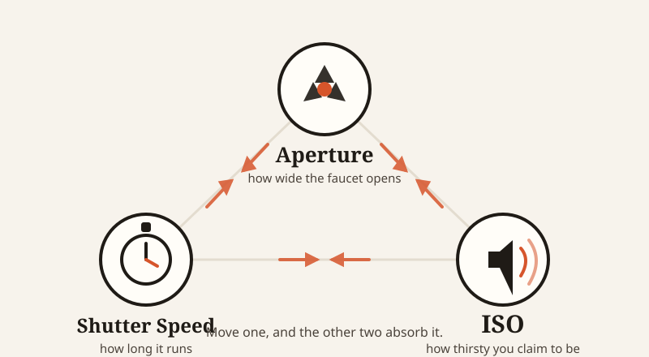
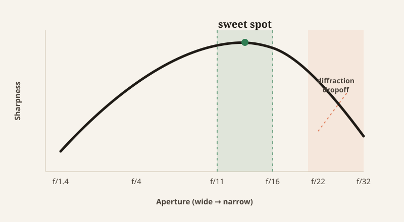

import CompareCard from '../../components/CompareCard.astro';

Closing your aperture all the way down should get you the sharpest photo possible. At f/32, you get a blurrier one instead. That's not a typo, and it's not your lens. It's the first clue that the "exposure triangle" isn't three dials you can each crank to their best setting — it's three settings that are all fighting each other, all the time.

## Three knobs, one pool of light

Picture a bucket sitting under a faucet.

**Aperture** is how far you open the faucet handle. Open it wide (photographers write this as a small number, like f/2.8) and water gushes out fast. Pinch it nearly shut (a big number, like f/16) and it's barely a trickle.

**Shutter speed** is how long you leave the faucet running. Ten seconds fills a lot more of the bucket than a tenth of a second does.

**ISO** isn't about the water at all — it's how thirsty you are. Crank it up and a half-full bucket suddenly counts as "enough." You didn't add any water. You just lowered the bar for what counts as full.

Here's the catch: open the faucet too wide and it splashes everywhere — a wide-open aperture blurs everything except one thin slice of your subject into a soft background. Leave it running too long and the bucket overflows — a slow shutter turns anything that moved into a streak. Decide you're "thirsty enough" with only a little water in the bucket, and you'll notice the water tasted a bit off — that's the grain a high ISO adds. Every fix comes with a side effect.

## Why you can't just fix everything at once

That's the trap of the exposure triangle: you cannot optimize all three settings at the same time. Move one to solve a problem, and you've just created a new problem the other two have to absorb.

Say you want to freeze a fast-moving subject — a sprinter, a dog mid-jump. That takes a fast shutter, something like 1/1000 of a second. But a shutter that fast lets in barely any light, so now you owe that light back somewhere else: open the aperture wider (which blurs your background) or push the ISO up (which adds grain). There's no setting that freezes motion, keeps everything in focus, *and* stays clean and grain-free in dim light. Pick two.

Or say you want a landscape photo where everything, foreground to horizon, is sharp. That needs a narrow aperture, like f/16, which blocks most of the light and forces a slow shutter. Fine on a still day — but if there's a waterfall or moving clouds in frame, they'll blur into streaks. A landscape with knife-edge focus everywhere and frozen-still clouds is not a setting combination that exists.

<CompareCard
  caption="Three real shoots — and what each one had to give up to get there."
  rows={[
    { term: "Portrait, blurred background", meaning: "f/1.8 · 1/125s · ISO 100 — wide aperture melts the background on purpose, but a group shot at this setting means some faces fall out of focus" },
    { term: "Indoor sports, frozen motion", meaning: "1/1600s · f/2.8 · ISO 3200 — freezes the athlete mid-air, but visible grain shows up in the shadows" },
    { term: "Waterfall, silky water", meaning: "30s · f/16 · ISO 100 (plus an ND filter) — turns rushing water to mist, but needs a filter blocking 90–99.9% of light just to survive a 30-second exposure in daylight" },
  ]}
/>

## The setting that isn't really about light

ISO is the odd one out here, and it's worth being honest about why. Aperture and shutter speed both physically control how much light reaches the sensor. ISO doesn't — it amplifies whatever light already arrived, the way turning up a stereo doesn't add new music, just volume. Turn it up too far and you also turn up the hiss: visible grain in the shadows and dark areas.

That's also why reciprocity works the way it does. One stop of aperture change (say, opening from f/16 to f/11) always needs a matching stop of shutter-speed change (say, going from 1/125 to 1/250) to land on the same exposure. Same water, different faucet-and-timer combination. Photographers on sunny days have long used a shortcut called the Sunny 16 rule: set your aperture to f/16 and your shutter speed to 1/(your ISO number) — for ISO 100, that's 1/100 of a second — and you're correctly exposed without ever touching a light meter.

## The trick that stops working if you push it too far

Which brings us back to that f/32 problem. Stopping your aperture all the way down should, in theory, keep pulling more and more of the scene into focus. And it does — right up until it doesn't.

Once you close the aperture down past about f/16, light passing through that tiny opening starts to bend around its edges and interfere with itself. That bending is called diffraction, and it happens at every aperture, all the time — it's just too small to see until the opening gets small enough. At f/32, it's no longer too small to see. The image actually gets softer, not sharper, because you've traded "everything roughly in focus" for "everything a little blurry from physics you can't dial away." The sweet spot most lenses land in is f/11 to f/16 — narrow enough for solid depth of field, not so narrow that the light itself starts working against you.

Even the "exchange one stop for another" math has a limit. It holds up cleanly for exposures roughly between 1/1000 of a second and 1 second. Push past that — into the multi-minute exposures astrophotographers use — and it quietly breaks down. Shoot a galaxy at f/4 and it might take around 30 minutes. Stop down two full stops to f/8, and the math says that should quadruple to about 120 minutes... but in practice it can take closer to 200. Long exposures don't just take proportionally longer; past a certain point, they take *disproportionately* longer, because the sensor (or film) itself gets less responsive the longer it sits there collecting light.

## There's no version where you win all three

None of this is a beginner problem you eventually outgrow. It's the actual shape of the tool. Every choice — freeze the motion, blur the background, keep everything sharp, keep it clean, hold the exposure — takes something from one of the other two. Even trying to "win" by cranking a setting to its extreme, like an aperture of f/32, runs into a wall the settings themselves put there.

The exposure triangle was never three knobs you turn up to eleven. It's one small, fixed pool of light, and three different ways of arguing over how to spend it.
