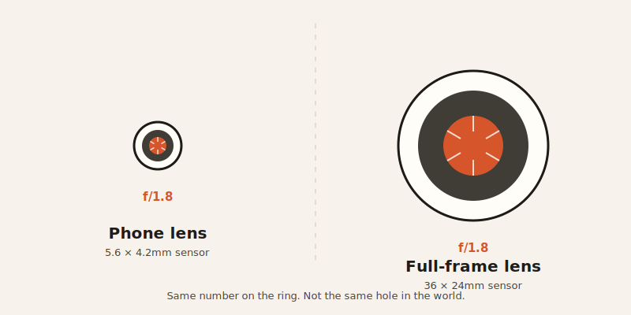
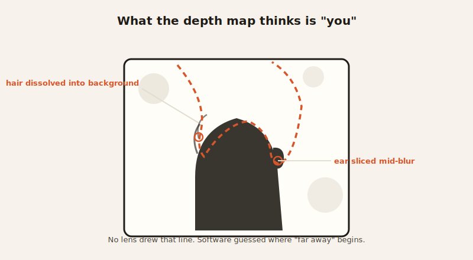

import CompareCard from '../../components/CompareCard.astro';

Your phone's camera app says f/1.8. The photo it just took behaves like f/16 — an aperture so small on a real camera you'd need a tripod and a lot of patience. Both numbers are "true." Only one of them describes what actually happened to the light.

## The three dials every camera shares

Film cameras and phone cameras both run on the same three controls, called the exposure triangle: ISO (how sensitive the sensor is to light), aperture (how wide the lens opens), and shutter speed (how long light hits the sensor). Turn one dial, and you usually have to turn another to compensate. That part of photography hasn't changed since film. What's changed is what those dials actually *do* once you turn them.

## Why your phone's aperture number is basically a marketing trick

Here's the part that doesn't transfer: aperture on a phone doesn't behave like aperture on a film camera, because of one thing neither number mentions — sensor size.

A typical phone sensor is about 5.6 by 4.2 millimeters. A full-frame camera sensor is roughly six times larger across, which means it's collecting about 37 times more light in the same conditions. That size difference doesn't just affect brightness — it changes how much of a photo stays in focus.

So when a phone lists an aperture of f/1.8 or f/2.2, it's telling the truth about the hole the lens opens. What it doesn't tell you is that, because the sensor behind that hole is so small, the resulting depth of field looks like what a full-frame camera gets at around f/16 — a setting real photographers use when they want *everything* sharp, front to back. It's the opposite of the shallow, blurry-background look the phone's spec sheet is implying.

Think of it like a car ad bragging about 0-60 in three seconds, measured on a car that weighs ten thousand pounds. The number is mathematically real. It just doesn't mean what you think it means once you know the rest of the picture.

## Portrait mode isn't optics. It's a guess.

Since your phone physically can't blur a background the way a big lens does, it fakes it. Portrait mode builds a depth map of your scene — a rough guess at what's "subject" and what's "background" — and then blurs the background in software. No light bent through glass. Just code deciding what counts as far away.

Most of the time it's convincing. Sometimes it isn't, and when it fails, it fails in ways an actual lens never would: cutting an ear off mid-blur, sharpening one eye while smearing the other, dissolving stray hairs into the background like they were never part of the person. A lens can't be "confidently wrong" about where your face ends. Software can, and does often enough that entire meme accounts exist just to collect the wreckage.

## What actually still works: the parts that were never about the camera

Not everything from film photography breaks on a phone. Composition rules — rule of thirds, leading lines, giving a photo a foreground to anchor on — have nothing to do with sensors or apertures. They're about how human eyes read an image, and human eyes haven't changed. Frame a phone shot the way you'd frame a film shot, and it works exactly as well.

Zoom is the trickiest case, because the old advice survives for a completely different reason. Film photographers were told to move closer instead of zooming, to avoid lens distortion and quality loss. On a phone, moving closer instead of zooming is still correct — but now it's because digital zoom is quietly destroying your photo. Zoom a 12-megapixel phone camera to 2x and you're not actually zooming; the camera crops the center of the sensor and stretches what's left, handing you an image with the real resolution of about 6 megapixels. It's the same math as cropping a photo afterward in an editor. The rule survived. The reason for it didn't.

## Apps that split into two honest camps

Once you know the sensor can't fake film for free, the apps built around film photography split cleanly into two categories: ones that admit they're a filter, and ones that give you real manual control and let physics do what it does.

<CompareCard
  rows={[
    { term: "VSCO", meaning: "Filter presets named after real film stocks (Kodak Portra, Fuji Superia). You adjust grain, tone, and exposure by hand to chase the look." },
    { term: "Huji Cam", meaning: "Recreates a 1998 disposable camera automatically — light leaks, date stamps, grain — with zero manual control. It fakes cheap on purpose." },
    { term: "Halide Mark II", meaning: "Full manual control over shutter speed, ISO, white balance, and focus, plus a real-time histogram and RAW capture. The closest a phone gets to a real camera's dials." }
  ]}
  caption="None of these fix the sensor. They just decide how honest to be about faking around it."
/>

## The rule that got the reason swapped out from under it

The strangest part of bringing film rules to a phone is that most of them still apply — just not for the reasons anyone originally wrote them down. Composition survives because it was always about eyes, not glass. Moving closer instead of zooming survives, but the villain changed from lens distortion to a sensor quietly throwing away pixels. And the aperture obsession that defines film photography survives on your phone only as theater — a number on a spec sheet that describes a hole in a lens, while the actual picture is decided by a sensor the size of a fingernail and some software making its best guess about your ears.

You can follow every rule perfectly and still hit a wall that was never about technique. That wall is called sensor size, and no app update fixes it.
