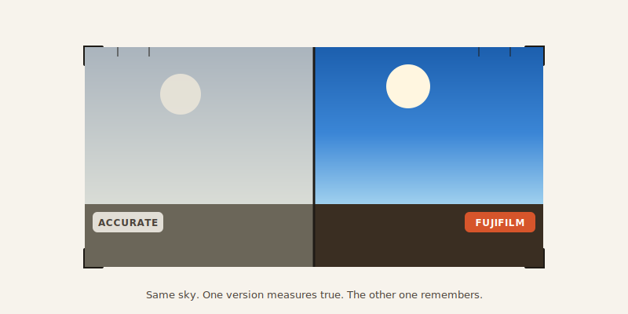

import CompareCard from '../../components/CompareCard.astro';

Fujifilm's most beloved camera colors fail a straightforward accuracy test, and the company built them that way on purpose.

## It's an Instagram filter, just older

Here's the simplest way to picture it: a film simulation is an Instagram filter, except it was invented decades before Instagram, for actual film.

You press one button on a Fujifilm camera, and it instantly changes the color, contrast, and grain of your photo — all at once, baked right into the file. Fujifilm has shipped 18+ of these over the years, with names borrowed straight from real film stocks the company used to manufacture: PROVIA, Velvia, ACROS, Classic Chrome, ETERNA.

One catch: this only touches JPEG files. If you shoot RAW, the simulation doesn't apply — the sensor data stays untouched underneath, waiting for you to edit it yourself later.

## Wrong, on purpose

Here's the part that sounds like a design flaw and isn't.

Fujifilm's engineers worked with photographers — and psychologists — to figure out how people *remember* colors, not how a color meter measures them. A sky you remember as vivid blue is usually less blue in reality than your memory insists. So Fujifilm's simulations nudge the blue up anyway, because a photo that matches your memory *feels* more correct than one that's technically accurate.

The result: independent color-accuracy tests grade Fujifilm's standard simulations lower than rival cameras. Fujifilm knows this. It's not an oversight — accuracy was never the target. Believability was.

## Three simulations, three completely different jobs

These aren't just color filters with different names slapped on — each one is tuned for a specific kind of photo, and using the wrong one in the wrong place actively makes photos worse.

<CompareCard
  caption="Same camera, three very different personalities."
  rows={[
    { term: "Velvia", meaning: "Maximum saturation and contrast — built for landscapes and sunsets, ruins skin tones (goes orange) on people" },
    { term: "ACROS", meaning: "Black & white with digital color-filter effects — yellow darkens skies a little, red darkens them dramatically, green lightens foliage for portraits" },
    { term: "ETERNA", meaning: "Deliberately flat and low-saturation — built for video, so editors have room to color-grade footage afterward" },
  ]}
/>

Point Velvia at a portrait and the skin tones swing orange. Point ETERNA at a single still photo straight out of the camera and it looks washed-out and dull — because it's not meant to be the finished product, it's raw material for a video editor.

## A filter that isn't really a filter

Old film cameras could screw a physical piece of colored glass onto the lens to darken a sky or lighten foliage. Digital sensors can't do that — there's no glass to swap, the sensor just captures every wavelength of light equally, all the time.

So Fujifilm's ACROS filter effects are a simulation of a simulation: software doing the math afterward to fake what colored glass used to do physically. The fake version is weaker than the real thing — glass darkens a sky more dramatically than software can convincingly pretend to. And yet photographers keep reaching for it anyway, because "good enough, instantly, with no extra hardware" beats "technically better, but you have to own the glass and remember to bring it."

## The short version

Fujifilm didn't set out to build the most scientifically accurate camera colors. It set out to build colors that feel right — the way a memory feels right, even when it's exaggerating a little. Grab the wrong simulation for the wrong subject and it shows immediately; grab the right one and a JPEG straight out of the camera can already feel finished, no editing required. That's the whole trade the "wrong" colors are making: give up a little accuracy, get a lot of feeling back.
