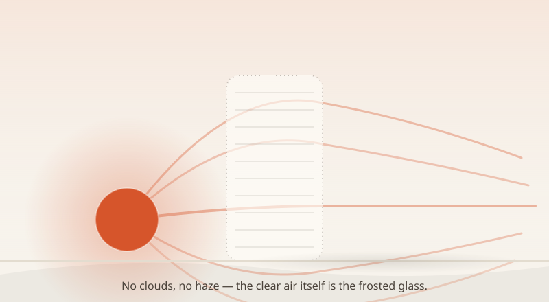

import CompareCard from '../../components/CompareCard.astro';

Point a light meter at a golden hour scene and it'll tell you there's 4 to 8 times less light hitting your subject than there was at noon. Look at the scene yourself, and it looks *brighter*. Warmer, glowier, more lit-up than the middle of the day ever did. One of those readings is lying to you, and it isn't the meter.

## The frosted-glass LED

Picture a bare LED bulb, the harsh kind, held right over your head. That's the midday sun: small, intense, directly overhead, casting one sharp-edged shadow straight down.

Now picture that same bulb held low, off to the side, shining through a sheet of frosted glass. It's still the same bulb. You can still tell exactly which direction it's coming from. But the light arrives softened — wrapped around edges instead of slicing past them, with shadows that fade out instead of stopping dead.

That frosted glass is the atmosphere. And here's the part that trips people up: on a perfectly clear golden hour evening, there's no actual frosted glass anywhere in the sky. No clouds, no haze required. The air itself does the frosting.

## Why a low sun crosses so much more sky

At noon, sunlight drops almost straight down and passes through what scientists call one "air mass" — one full thickness of atmosphere, the baseline.

At golden hour, the sun sits just 6 to 15 degrees above the horizon. Instead of a short drop through the air, its light comes in at a steep, grazing angle — and travels through roughly 38 air masses to reach you. That's not 38% more air. It's the light crossing something like 10 to 40 times more atmosphere than it does at noon, all because of the angle.

More air in the way means more chances for that light to bump into air molecules and dust and bounce off in a new direction — which is exactly what turns a small, harsh point of light into something that arrives from many directions at once, without ever stopping being directional. The sun is still a single point source the whole time. The atmosphere is just standing in a lot more of its way.

## Where the color comes from

That extra distance doesn't just soften the light — it also filters it.

Blue and violet light scatter away in air far more easily than red and orange do; physicists measure it at roughly 16 times more intensely for the shortest wavelengths. Over a short trip through the air at noon, only a little blue gets knocked out, which is why midday light reads as a cool, neutral white — about 5500 to 6500K on the color temperature scale (the scale used to describe how warm or cool a light source looks).

Push that light through 38 air masses instead of one, and there's a lot more air for the blue to scatter out of on the way. What's left by the time it reaches your eyes is mostly the warm end of the spectrum — around 3000 to 4000K. Same sun, same sunlight leaving the same star. A 2000K color shift, entirely explained by how much air got in the way.

<CompareCard
  caption="Same sun, two very different trips through the sky."
  rows={[
    { term: "Sun angle", meaning: "Noon: near-overhead · Golden hour: 6–15° above horizon" },
    { term: "Air the light crosses", meaning: "Noon: ~1 air mass · Golden hour: ~38 air masses" },
    { term: "Color temperature", meaning: "Noon: 5500–6500K (cool white) · Golden hour: 3000–4000K (warm amber)" },
    { term: "Light reaching you", meaning: "Golden hour reads 2–3 stops darker on a meter — about 4 to 8 times less light" },
  ]}
/>

## The illusion that fools beginners

This is the part that makes golden hour genuinely tricky to shoot: it *feels* brighter than it measures.

A light meter pointed at the same spot at noon and again at golden hour will show a real difference — 2 to 3 stops, meaning 4 to 8 times less light actually landing on your subject. But your eyes don't read a scene in stops. They read warmth as brightness. Amber light *feels* more luminous than it measures, and that perceptual trick is exactly what talks beginners into overexposing their golden hour shots — they trust their eyes over the meter, and the meter was right.

## Why some mornings and evenings don't match

Not every golden hour looks the same, even at the identical sun angle and the same spot on Earth.

Dust, pollution, and water vapor scatter light too — through a different process than the blue-depleting scatter above, one that treats all colors more evenly but adds a general haze. That particle load builds up over the course of a day and settles back down overnight. So morning golden hour, after a night of dust settling out of the air, tends to come out crisp and bright gold. Evening golden hour, after a full day of that dust and haze building back up, tends to come out hazier and muddier — same city, same latitude, same sun angle, different amount of stuff floating in the air between you and the sun.

## Golden hour barely exists in half the world

Here's the twist nobody warns you about: how long you actually get golden hour depends entirely on where you're standing.

At the equator, sunrise and sunset happen almost straight up and down — the sun crosses that low-angle zone fast, so golden hour lasts around 20 minutes total, combining both morning and evening. Photographers there don't linger, they run.

Head up to 60° latitude in summer, and the sun crosses the sky at a shallow, lazy angle instead — golden hour stretches past 2 hours, and twilight barely finishes before dawn starts again. Push all the way into the Arctic in summer and the sun never fully sets at all, so "golden hour" just... never ends. The lighting condition everyone treats as a rare, precious sweet spot is really a geometry problem, and depending on your latitude, geometry might hand you 20 minutes or hand you the whole day.

## So it was never about clouds

Nothing about golden hour requires weather. No clouds, no fog, no haze filter needed — a bone-dry, cloudless sky does the whole trick on its own, just by making sunlight travel sideways through far more air than it ever does at noon. The sun doesn't change. The bulb doesn't change. You just, for a narrow window every day, get to see it through 38 times more frosted glass.
