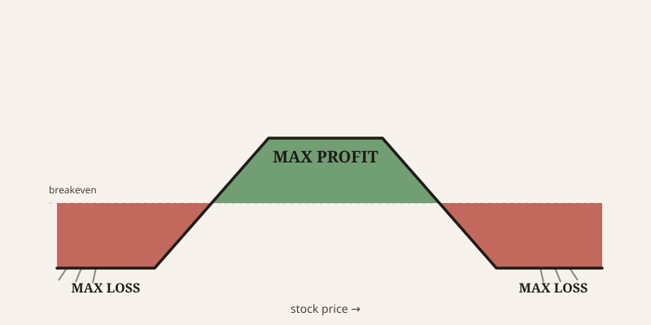
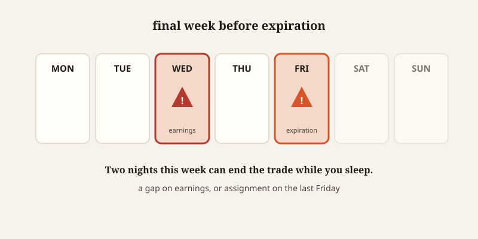

import CompareCard from '../../components/CompareCard.astro';

A trader can be right about a stock seventy-five times out of a hundred — and still go broke doing it.

## Betting nothing crosses the line

Imagine you own a store on a street with a speed limit. You bet your neighbor $100 that no car will go faster than 45 mph or slower than 15 mph past your building before a certain date. You pocket that $100 right now, today.

If traffic stays between 15 and 45 mph the whole time, you keep it. Free money. But if a car roars past at 60, or crawls by at 5, you owe your neighbor $500.

You got paid up front for taking a risk at 5-to-1 odds against you. That bet has a name in the options world: an iron condor.

## What you're actually holding

An iron condor is four separate options trades, opened together, all expiring on the same date:

<CompareCard
  caption="Four legs, one position, same expiration date"
  rows={[
    { term: "Sell a put", meaning: "Sets your lower line — you collect a premium" },
    { term: "Buy a further-out put", meaning: "Caps your loss if the stock crashes" },
    { term: "Sell a call", meaning: "Sets your upper line — you collect a premium" },
    { term: "Buy a further-out call", meaning: "Caps your loss if the stock spikes" },
  ]}
/>

The two "sell" legs are your speed limit lines. The two "buy" legs exist purely to cap the damage if a car blows through them. As long as the stock stays between your sold put and your sold call until expiration, you keep the entire premium you collected — that's your max profit. If the stock breaks through either side, your loss is capped too, at the width of one spread minus the credit you were paid.

## The high win rate that hides the truth

Here's the part that should make you sit up. Iron condors have a real, measured win rate of 65 to 70% left alone, or 78 to 82% if a trader manages them actively. That sounds like a strategy you can't lose with.

But the payoff is asymmetric. A typical iron condor might risk $850 to make $150. Do the math on that: win five trades in a row and you're up $750. Lose just one, and you're down $850 — more than every win combined. A trader can be right three times out of every four and still watch their account shrink, because the one loss is built to be bigger than the wins that came before it.

Most trading content advertises the win rate. Almost none of it puts the loss size next to it on the same page.

## Three real trades, three different endings

<CompareCard
  caption="Same strategy, three different stocks — notice the shape repeats"
  rows={[
    { term: "Costco (COST)", meaning: "Risked $790 to make $210 — closed early for the win" },
    { term: "SPX (S&P 500)", meaning: "Risked $800 to make $200 — needed the index between 4,950 and 5,140" },
    { term: "AAPL (Apple)", meaning: "70% odds of profit — risked $312 to make $88" },
  ]}
/>

The Costco trade is the clean version of the story: strikes set at 450/460 on the put side and 515/525 on the call side, for a $2.10-per-share credit against a $7.90-per-share risk. The stock traded around $491 — comfortably inside the wings — and stayed there for five days. The trader didn't even wait for expiration. They took the win early and moved on.

## Time is quietly on your side

Every day that passes without the stock breaking out, an iron condor gets a little more valuable to the person who sold it. This is called theta decay: the short options (the ones you sold) lose value faster than the long options (the ones you bought), especially in the final two weeks before expiration. You're not just betting the stock stays flat — you're being paid, gradually, for every day it does.

## The volatility paradox

Iron condors also have what's called negative vega, meaning the trade profits when volatility falls. That sounds like an extra edge. It usually isn't one.

Before events like earnings, the market already knows a bigger move is coming — that's exactly why it prices in extra premium beforehand. The bigger premium you're being offered to sell an iron condor around earnings isn't a discount. It's the market pricing in the very risk that's about to make your bet more dangerous. It is not free money.

## Why it's called an "iron condor" at all

This part is almost an anticlimax. The strategy is named "iron condor" because the shape of its profit-and-loss diagram — flat in the middle, dropping off sharply on both sides — resembles a large bird with its wings spread. Condors happen to be real birds with nine-foot wingspans. Someone drew the payoff chart, thought "that looks like a condor," and the name stuck to a serious financial instrument forever.

The "iron" part is even less exciting. It just means the trade uses both puts and calls together, as opposed to using only one type. So you are, technically, wearing a metaphorical iron suit made of two kinds of insurance. It's a strange name for a fairly ordinary idea, and it survives purely because everyone already uses it.

## How to actually survive it

The traders who post the higher, 78-82% win rates aren't finding a better trade. They're managing the same trade differently: closing at 50% of max profit instead of holding until expiration. On a trade with $200 of max possible profit, that means buying it back once it's worth $100 and calling it a win.

It sounds like leaving money on the table, and it is. It's also how you avoid the last stretch of the trade, when gap risk and assignment risk are highest and the reward left on the table is smallest.

## The two ways to lose overnight

Two specific things can turn a winning-looking trade into a max loss while you're asleep.

The first is an earnings gap. A stock can move 10 to 20% overnight on earnings — a genuinely rare, large move — and blow through both your short put and your short call at once. There's no window to exit or adjust. You go to bed comfortably inside your wings and wake up at max loss.

The second is assignment. Options like these are American-style, meaning they can be exercised any time. On the last Friday before expiration, if your short put ends up in-the-money by even a single cent, your broker can assign you 100 shares of stock overnight. You didn't choose to buy that stock. You just did, and depending on your account, that can trigger a margin call.

## The real lesson

Win rate, by itself, tells you almost nothing about whether a strategy makes money. An iron condor can be right most of the time and still lose money overall, because the size of the rare loss was never designed to match the size of the frequent win. If you only ever look at how often a trade works, you're reading half the page.
