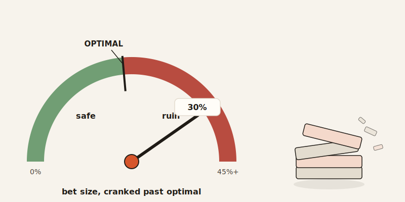
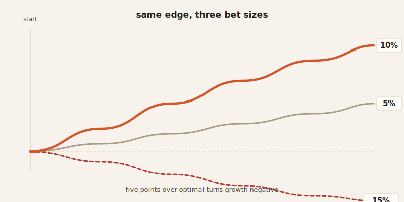

import CompareCard from '../../components/CompareCard.astro';

A trader with a genuine, verified 65% win rate on Bitcoin can watch 72% of their account disappear in three trades — because the formula that's supposed to protect them told them to bet 30% of it each time.

## The peanut budget

Say you get $100 a week for chores. Some weeks there's a bonus if you do extra. Now imagine deciding what percentage of that $100 to spend on peanuts this week, based on how sure you are peanuts go on sale next week.

If you're 55% confident there's a sale coming — and the discount is worth it — there's an exact, calculable answer for how many peanuts to buy now to grow your peanut-buying power over many weeks. Buy too few, and you leave money on the table. Buy too many, especially on borrowed allowance, and one bad week wipes out your whole peanut operation.

That's the Kelly Criterion. It's a formula for exactly this trade-off, just applied to bets, trades, or bankrolls instead of peanuts.

## What it actually says

The formula is: **f = (bp − q) / b**

- f = the fraction of your money to bet
- b = the odds you're being paid (minus 1)
- p = your probability of winning
- q = your probability of losing (just 1 − p)

Plug in real numbers and it spits out a real percentage. Win 55% of the time at 110 odds, and Kelly tells you to bet 1.36% of your bankroll. Not a round number, not a guess — a specific answer, computed from your actual edge.

One rule sits underneath all of it: if you don't have a genuine edge — if your odds of winning aren't actually better than the odds being offered — Kelly's answer is zero. Bet nothing. The formula isn't a system for finding edges. It only tells you what to do once you already have one.

## Built by a physicist who wasn't thinking about gambling at all

John Kelly Jr. worked at Bell Labs in 1956, and he wasn't trying to solve horse racing. He was researching information theory — how efficiently signals travel down a noisy phone line. The betting version of his formula turned out to maximize something specific: not your average winnings, but the long-term *growth rate* of your money, compounding bet after bet after bet.

That distinction — growth rate over time, not just expected value on a single bet — is the whole reason the formula behaves so differently from ordinary "bet more when you're confident" intuition.

## The part that should scare you more than it does

Here's the asymmetry nobody warns you about: betting too little costs you speed. Betting too much costs you everything.

Say Kelly calculates your ideal bet at 10% of your bankroll. Bet half that — 5% — and you still grow your money, just slower: about 75% of full-Kelly's returns, with half the ups and downs. That's a mild, forgivable mistake.

Now bet 15% instead of 10% — just five points over. Your growth rate doesn't slow down. It goes **negative**. You're now mathematically guaranteed to go broke eventually, no matter how real your edge is. Underbetting is a speed bump. Overbetting is a cliff, and the cliff starts closer than it looks.

## What that looks like with real money

A trading strategy with a 60% win rate and a 1:2 reward-to-risk ratio computes to a 10% "full Kelly" bet size. Run that strategy through five losing trades in a row — which happens, even to real edges — and here's the damage:

<CompareCard
  caption="Same strategy, same losing streak. Only the bet size changed."
  rows={[
    { term: "Full Kelly (10% per trade)", meaning: "41% drawdown · $1,000 becomes $590" },
    { term: "Half Kelly (5% per trade)", meaning: "22.6% drawdown · $1,000 becomes $774" },
  ]}
/>

Same edge. Same five losses. Cutting the bet size in half nearly halves the damage. Nobody who's actually traded through a losing streak looks at that table and picks full Kelly.

## The crypto trader from the top of this post

Now the example this post opened with, in full. A trader has $10,000 and a strategy they've genuinely verified wins 65% of the time on Bitcoin positions. Kelly's formula, run honestly on those numbers, says bet 30% of the account per trade.

They do it. Three losses land in a row — random, and not even unlikely, over enough trades. 72% of the account is gone. This is what "most retail crypto traders blow up here" looks like from the inside: not a bad edge, not a broken formula, just the full-strength version of a correct answer meeting a normal losing streak.

## When it actually works

None of this means Kelly is wrong — it means full Kelly is unforgiving. Used carefully, the same logic has made people rich.

Ed Thorp used it at the blackjack table in the 1960s: bet about 2% of his bankroll when the remaining cards favored him, drop to under 1% or nothing when they didn't. It's a documented part of how he became a millionaire playing a beatable casino game. Decades later, Thorp studied Warren Buffett's portfolio and noticed the same pattern by instinct rather than formula: Buffett concentrates capital into his best ideas instead of spreading it evenly — which is exactly what Kelly logic recommends when your edge is real and sized correctly.

## Why almost nobody runs it at full strength

Kelly gives you the mathematically perfect bet size — and that perfect size will bankrupt you faster than almost any wrong size, the moment your probability estimate is even slightly off. It's a GPS that gets you there in record time, right up until you mistype the address by one digit and it confidently drives you off a cliff at full speed.

That's why the professional move isn't "full Kelly." It's half-Kelly, or even quarter-Kelly — deliberately betting less than the "optimal" answer, on purpose, forever. It sounds like giving up the edge of the math. It's actually the only part of the math anyone survives long enough to benefit from.
