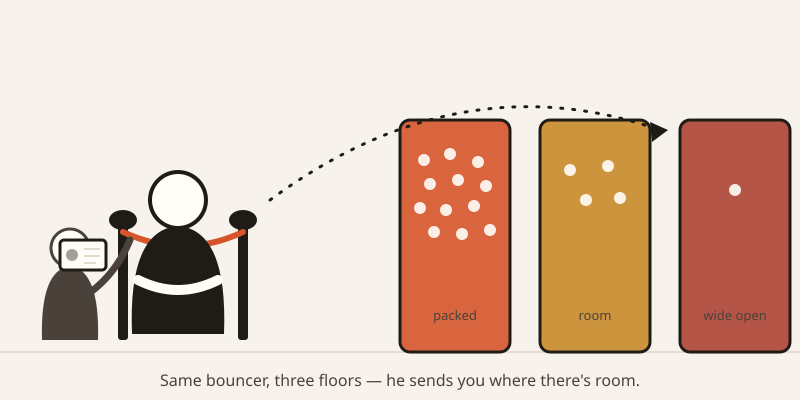
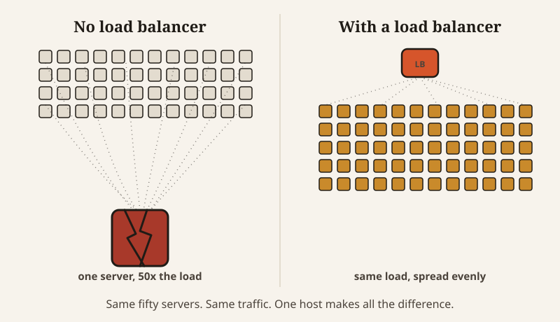

import CompareCard from '../../components/CompareCard.astro';

Picture an e-commerce site running fifty web servers on Black Friday. Without anything directing traffic between them, shoppers would pile onto whichever server they happened to hit first — and that one server, built to handle a fiftieth of the load, would take fifty times what it was designed for and crash in seconds.

## One door, several floors

Think of a club with one entrance and three separate dance floors inside. A single bouncer at that door would get crushed. So the venue hires a bouncer for each floor instead, and puts a host at the entrance whose only job is deciding, instantly, which floor each arriving guest goes to. If a bouncer calls in sick, the host just stops sending anyone that way.

That host is a load balancer. The guests are incoming requests — someone loading a page, checking out a cart, hitting a login screen. The floors are backend servers, the machines that actually do the work. Fifty servers on Black Friday are fifty floors. The load balancer is the only reason a shopper's request lands on whichever floor has room, instead of all of them mobbing the nearest door.

## How the host picks your floor

There isn't one way to make that call — there are four common ones, and they solve genuinely different problems.

<CompareCard
  caption="Four ways a load balancer can pick your server"
  rows={[
    { term: "Round-Robin", meaning: "Simple rotation — server 1, then 2, then 3, then back to 1" },
    { term: "Least Connections", meaning: "Sends you to whichever server has the fewest active requests right now" },
    { term: "IP Hash", meaning: "Routes you by your IP address, so you land on the same server every time" },
    { term: "Weighted", meaning: "Sends more traffic to the more powerful servers in the group" },
  ]}
/>

Round-robin is the simplest of the four — no counting, no memory, just take turns — which is exactly why it's still a common default.

## Checking a ticket vs. reading the whole conversation

Load balancers also differ in how closely they look at what's coming through the door. A **Layer 4** load balancer only checks the equivalent of a ticket — it looks at the connection itself (the technical terms are TCP and UDP) and nothing more. Fast, but it can't tell one request from another beyond that.

A **Layer 7** load balancer reads further — the actual web address being requested, the specific hostname, the headers attached to the message — and routes based on what it finds. That's how it can send `api.example.com` one way and `web.example.com` another, or split `/api/*` traffic from `/static/*` traffic, even though both arrived at the exact same front door.

## Walking the floor

The other half of the host's job is checking who's still standing. A load balancer does this constantly — it's called a health check. It pings each backend server on a schedule (sometimes a simple ping, sometimes a full HTTP request, sometimes a custom check), and the moment one stops answering, it's quietly pulled from rotation. No new traffic goes there until it responds normally again. That's the actual mechanic behind "if one server goes down, the site doesn't": the load balancer already knew before you did.

## The bouncer who remembers your usual booth

That "IP Hash" row from earlier is worth a second look, because sending the same visitor to the same server every time — called a **sticky session** — solves a real problem. Add three things to your cart, and if your next click routes to a different server that's never heard of you, your cart just vanishes.

But sticky sessions have a funny way of undoing the whole point. Once a server has hundreds of visitors "stuck" to it, it's carrying hundreds of people's worth of load while other, emptier servers sit idle nearby — like a host who insists on reseating every regular at their usual booth, even when every other booth in the place is open. And if that one overloaded server goes down, all of its stuck visitors go down with it at once. Plenty of developers only learn this after it's already happened to them.

## When the host makes things worse

Here's the part that sounds backwards: a load balancer can slow a site down instead of speeding it up. Every request now takes an extra hop — through the load balancer first, then the server — and that hop costs a sliver of time no matter how well it's configured. Combine that with round-robin sending very different jobs to servers in strict rotation, and you can end up with one server buried in slow requests while another sits nearly idle, both supposedly getting an "equal" share. A host who's slow to decide, or keeps guessing wrong about who should go where, isn't actually helping anyone get in faster.

## The scale this runs at

None of this is small. **nginx**, a free, open-source Layer 7 load balancer, runs roughly a third of the web's servers. **AWS's Elastic Load Balancer** manages this automatically for Amazon's own EC2 servers. And **HAProxy** — also free, also open-source, used by GitHub, Stack Overflow, and Twitter — is the load balancer standing behind that fifty-server Black Friday example from the top of this post: without it, one server eats fifty times its normal traffic and crashes; with it, the same fifty servers share that traffic instead. The load-balancing market behind all of this is worth more than $7 billion a year.

## The nested absurdity

There's one more twist. The load balancer itself is a single thing sitting in front of everything else — so if it goes down, nobody gets in at all, no matter how many healthy servers are waiting behind it. Production systems deal with this by running load balancers in pairs or clusters, which means somewhere out there, something is load-balancing the load balancers. The host has a host.
