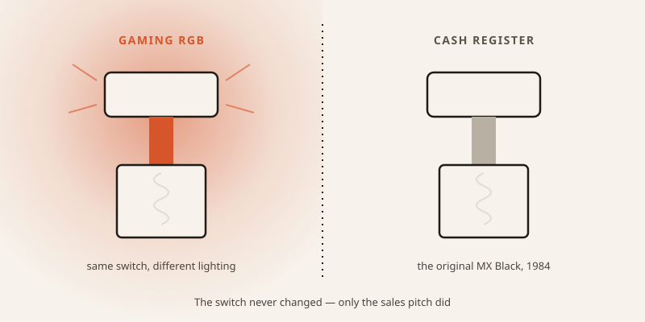
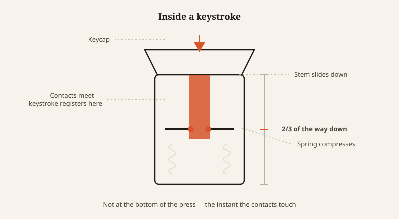

import CompareCard from '../../components/CompareCard.astro';

Right now, in a supermarket somewhere, a cashier is scanning your groceries on a keyboard built with the exact same switch gamers pay a premium for — and it has nothing to do with gaming.

## A switch built to slow you down, on purpose

In 1984, Cherry needed a switch for point-of-sale terminals — the keyboards under cash registers. Cashiers type fast, under pressure, and a single stray keypress can ring up the wrong item or charge the wrong amount. So Cherry built a switch with a stiff spring: heavier to press than normal, so it's harder to trigger by accident.

That switch is the MX Black. For most of its life, it was a boring industrial part sitting inside silent checkout counters. Nobody outside the point-of-sale industry knew it existed. Then, decades later, gaming communities discovered it, liked how it felt, and started buying it for gaming keyboards. The switch never changed. Only the sales pitch did.

Cherry's own marketing tagline is "#ORIGINALMX: Often Copied, Never Reached" — aimed at cheap knockoffs. The irony: the *real* Cherry MX switch, right now, might be sitting under less money in a grocery store register than the "gaming" knockoff on your desk.

## What's actually happening when you press a key

Strip away the marketing and a mechanical switch is a simple machine: a spring and a stem.

You press a key. The stem — the moving part under the keycap — slides down. A metal spring underneath compresses. At some point on the way down, the stem connects two separate electrical contacts, completing a circuit, and your computer registers the keystroke. Let go, and the spring pushes the stem back up, ready to fire again.

That's the whole mechanism. No rubber, no guessing whether you pressed hard enough — just a spring and a metal contact.

## The keystroke registers before you even finish pressing

Here's the part that trips people up: the keystroke doesn't register when you hit bottom. It registers on the way down.

Most switches trigger somewhere between 1.2 and 2.2 millimeters into the press — well before the key is fully depressed. That's why mechanical keyboards feel "fast." You don't have to finish the motion to get the result. Compare that to a rubber dome keyboard (the mushy kind under most laptop keys), which typically needs you to press all the way to the bottom before the dome collapses enough to make contact.

It's the same logic as a mousetrap: the trap doesn't fire when the bar finally slams shut. It fires the instant the trigger plate is pressed past its threshold — the commitment point, not the destination.

## Why each key works independently

There's a second reason mechanical keyboards feel more reliable: every switch has its own private electrical path, usually backed by a small diode.

That matters more than it sounds like. It means the keyboard can tell exactly which keys are down at any moment, even if you're pressing several at once — a trait called N-Key Rollover. It also prevents "ghosting," where pressing certain key combinations on a cheaper keyboard causes a *different*, unintended key to register, or a key to silently drop. Rubber dome keyboards mostly can't do this — there's nowhere to mount the diodes needed to keep each key's signal separate.

## Color-coded feel: the industry's cheat sheet

Not every switch feels the same, and Cherry's stem shape plus spring weight became the de facto standard the whole industry copied — down to the color names.

<CompareCard
  rows={[
    { term: "Linear (e.g. Cherry MX Red)", meaning: "Smooth top to bottom, no bump, no click — 45 centinewtons of force, fast and light" },
    { term: "Tactile (e.g. Cherry MX Brown)", meaning: "A small bump partway down you can feel but not hear — a physical 'yes, registered'" },
    { term: "Clicky (e.g. Cherry MX Blue)", meaning: "A bump you feel AND hear — 60 centinewtons, 2.2mm pre-travel, audible click" },
    { term: "Stiff / industrial (Cherry MX Black)", meaning: "60 centinewtons, no bump, deliberately hard to trigger by accident" },
  ]}
  caption="Red = linear, Brown = tactile, Blue = clicky. Cherry made up the color code in the 1980s; the rest of the industry just kept using it."
/>

Speed has its own extreme, too: the Cherry MX Speed Silver actuates at just 1.2mm instead of the usual 2mm — about 40% less travel — which is why it shows up in competitive esports keyboards, where shaving milliseconds off a keystroke is the entire point.

## The switch that can make you type *worse*

Here's the counterintuitive part. Switching to a lighter, faster mechanical switch doesn't automatically make you a better typist. Sometimes it makes you worse.

On a heavier keyboard, your weaker fingers — pinky, ring finger — naturally need more effort to press a key, which keeps your typing rhythm roughly balanced. Swap in a light switch like the MX Red, and suddenly your weak fingers can fire just as fast as your strong ones. That sounds like an upgrade. In practice, it can scramble the timing your fingers learned over years, and characters start landing out of order. Gamers, who often build fresh muscle memory anyway, tend to adapt fine. People with years of typing habits on heavier keyboards sometimes don't.

The "better" switch, in other words, isn't universally better. It's better at a specific job, for a specific person.

## The part that barely wears out

Whatever switch you land on, it's built to last absurdly long. The original Cherry MX contacts are gold-plated — gold resists oxidation, so the electrical connection stays clean over time — and they're rated for up to 100 million keypresses with no meaningful degradation. Other switch variants land around 50 million.

For comparison: even a genuinely obsessive typist would need decades of daily use to get anywhere near that ceiling. The switch under your fingers will very likely outlast the rest of the keyboard around it.

## The gaming switch was never about gaming

Which brings it back to where this started. The switch industry's biggest marketing category — "built for gamers" — is mostly repackaged industrial engineering. The MX Black was built to protect cash registers from panicked cashiers. The tactile bump on a Brown switch and the audible click on a Blue exist because someone, decades ago, wanted typists to *feel* and *hear* confirmation that a keystroke landed — not because a marketing team decided clicky sounds intense.

Somewhere between a checkout counter in 1984 and a gaming setup today, the same spring-and-stem mechanism picked up a completely different story. The mechanism never asked to be exciting. It just had to not misfire under pressure — whether that pressure is a Black Friday checkout line or a competitive match with a scoreboard on the line.
