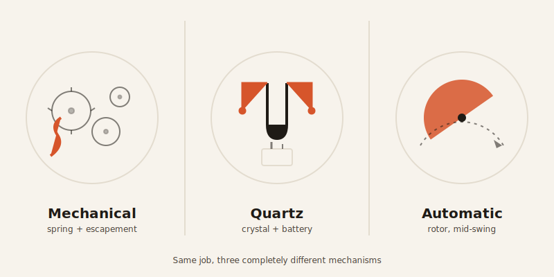
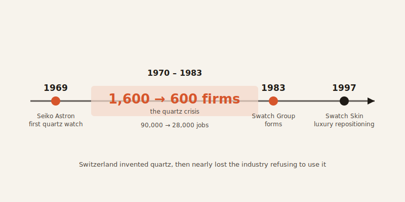

import CompareCard from '../../components/CompareCard.astro';

A $5,000 mechanical watch keeps worse time than a $20 quartz watch from a drugstore rack — and the people paying $5,000 know this, and buy it anyway.

## Three ways to make a watch tick

A mechanical watch is basically a hand-crank toy that winds itself as you wear it. A spring stores energy, like the twist you put into a wind-up car, and a tiny mechanism releases that energy in controlled ticks instead of letting it all go at once. An automatic watch is the same toy, except it winds itself back up every time you move your wrist. Quartz is a different animal entirely — not mechanical at all, but an electronic metronome. A battery powers a sliver of quartz crystal that vibrates 32,768 times a second, and that vibration is the clock.

One of these is dramatically more accurate. It is not the expensive one.

## Quartz: the one that's basically cheating

That number — 32,768 vibrations per second — isn't chosen because quartz likes to vibrate at that exact rate. It's chosen because 32,768 is 2 to the 15th power, and digital circuits are very good at dividing by two. Halve that number 15 times and you land on exactly one pulse per second, which is all a clock actually needs. Someone designed the most precise mass-market timekeeping device in history because binary math is easier than any other kind of math. That's the whole reason.

The payoff for that arbitrary choice is real: a quartz watch drifts about 15 seconds a month, which works out to 0.0006% error — 6 parts per million. Temperature knocks that around a bit; swing 10°C off normal and you pick up roughly 110 extra seconds of drift over a year. Even so, that's at least an order of magnitude more accurate than a mechanical watch manages, and you can buy one for $20.

The **Seiko Astron**, launched December 25, 1969, was the first quartz watch you could actually buy — at a moment when mechanical was simply what a watch was. By 1978, less than a decade later, quartz had overtaken mechanical as the more popular choice worldwide. That's how big the accuracy gap was.

## Mechanical: hand-wound, and proud of the inefficiency

Pop a mechanical watch open and there's no chip anywhere. Just a coiled ribbon of hardened steel — the mainspring — wound by hand, storing energy the same way twisting a toy stores energy. Since 1945 that spring has typically been a special metal alloy, and a "going barrel" design (dating back to 1760) keeps the force it releases more consistent as it unwinds. Most modern mainsprings run 36 to 72 hours on a single wind.

The clever part is the escapement, which stops that stored energy from dumping out all at once. Each swing of the balance wheel — a small wheel that rocks back and forth 270 degrees in each direction, acting like a tiny mechanical pendulum — releases the gear train by exactly one tooth. That's the tick. Then it locks again. Tick. Lock. Tick. Lock. The lever escapement, the design that's dominated watches since the 1800s, does this far more precisely than anything that came before it — and it's still not in the same league as a vibrating crystal.

## Automatic: the one that winds itself

An automatic watch is a mechanical watch with one addition: a semicircular weight called a rotor, which swings freely as your wrist moves and winds the mainspring for you. No daily winding required — just wear it.

Self-winding isn't new. Abraham-Louis Perrelet built the first version back in 1776–1777, for pocket watches, but pocket watches mostly sat still in a pocket, so the idea didn't have much to grab onto. It took until the 1920s and 1930s for self-winding to actually make sense on a wrist that moves all day.

Here's the genuinely funny bit: in 1863, watchmaker Adrien Philippe patented a slipping mainspring — a safety device to stop the spring from being wound too tight and snapping. That's a solution to overwinding, invented roughly sixty years *before automatic watches existed to cause the problem*. It's the equivalent of patenting a car airbag in 1850.

The **Rolex Perpetual**, from 1931, was the first rotor design that actually worked in a wristwatch — earlier attempts at self-winding hadn't managed to make it practical. Rolex had already built a waterproof case, the Oyster, in 1926, and would go on to combine the automatic rotor with a chronometer-certified movement in the Datejust. The brand had been chronometer-certifying watches since 1910.

## Side by side

<CompareCard
  caption="Same job — keep time — three completely different ways of doing it."
  rows={[
    { term: "Power source", meaning: "Quartz: battery · Mechanical: hand-wound spring · Automatic: wrist motion" },
    { term: "Accuracy", meaning: "Quartz: ~15 sec/month drift · Mechanical & automatic: an order of magnitude worse" },
    { term: "Needs winding?", meaning: "Quartz: no · Mechanical: yes, daily-ish · Automatic: only if you stop wearing it" },
    { term: "First practical version", meaning: "Quartz: Seiko Astron, 1969 · Automatic: Rolex Perpetual, 1931" },
  ]}
/>

## The plot twist: Switzerland invented quartz, then nearly died refusing to use it

Quartz watch technology came out of Switzerland. Then the Swiss mostly declined to build it, because mechanical watchmaking was tangled up with national identity, and quartz felt like giving that up.

The result was the quartz crisis. Between 1970 and 1983, the number of Swiss watchmaking firms fell from 1,600 to 600. Industry employment dropped from 90,000 people to 28,000. An entire national industry nearly collapsed because it wouldn't use its own invention.

The recovery came through repositioning, not competing on accuracy. The Swatch Group formed in 1983, and the turnaround leaned on selling mechanical watches as luxury and identity rather than as practical tools. In 1997, Swatch marketed the Swatch Skin as the "world's thinnest plastic watch" — cheap, colorful, disposable, sold as a casual art object rather than a precision instrument. It worked. It became one of the moves that pulled Swiss watchmaking back from the edge.

## So why buy the watch that loses the race?

Here's where it gets almost absurd. COSC, the body that certifies "chronometer-grade" mechanical watches, certifies over 1.8 million of them a year — putting each through tests across multiple days, positions, and temperatures. The standard it certifies to allows ±6 to ±120 seconds of drift *per year*. A $20 Citizen quartz watch does ±15 seconds *per month*, no certification ceremony required. Chronometer certification, at this point, isn't measuring practical accuracy. It's a craftsmanship credential — a stamp that says "a person built this carefully," not "this is the most accurate watch you can buy."

Quartz, meanwhile, kept quietly improving at the one thing it's supposed to do. Citizen's **Eco-Drive**, introduced in 1995 and making up 80% of the company's line by 2011, converts light hitting the dial into electricity through a photocell, so it never needs a battery swap. Power reserves run from 30 days to 3,175 days — that's 8.7 years — in the dark, and the secondary cells last up to 40 years. By 2007, that had kept an estimated 10 million disposable batteries out of the trash in North America alone.

So the honest comparison isn't close. Quartz is more accurate, cheaper, and getting more self-sufficient every decade. Mechanical and automatic watches are objectively worse at telling time and have been since 1969. And people still buy them, at luxury prices, specifically because they're the harder, less practical, more human way to do the job — which turns out to be the entire point.
