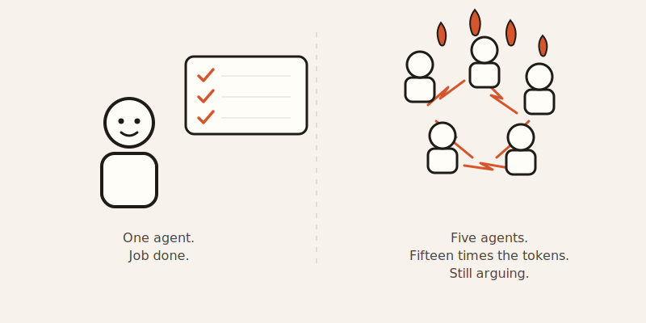
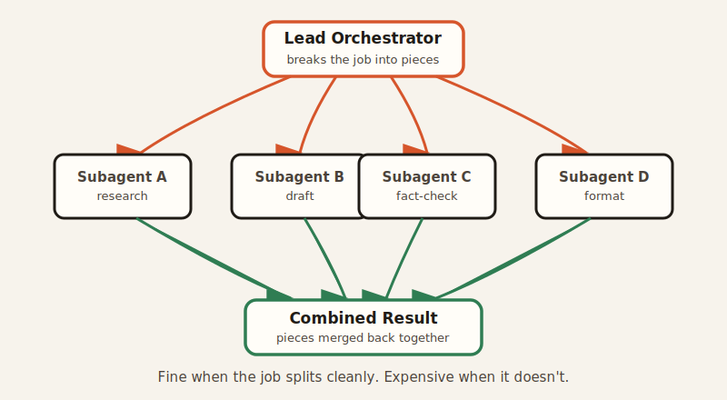

import CompareCard from '../../components/CompareCard.astro';

It costs fifteen times more to run, and it can still lose to a single AI working alone.

## The freelancer and the agency

Picture a solo freelancer. They can write copy, do a bit of design, answer emails, chase invoices. Give them a small job and they're fine. Give them a sprawling one, and they start dropping balls.

Now picture an agency instead. A researcher digs up facts. A writer drafts. An editor tightens it. A project manager keeps everyone pointed at the same deadline. Nobody does everything — each person owns one slice, and they coordinate to ship the whole thing.

Multi-agent AI is the agency version of an AI system. Instead of one model juggling a whole problem, a lead "orchestrator" agent breaks the job into pieces and hands each piece to a specialized subagent working in parallel.

Here's the part the agency metaphor doesn't warn you about: hiring an agency for a one-page flyer is a waste of money. Multi-agent AI has that exact problem, and the industry hype has mostly skipped over it.

## When the team actually wins

Anthropic tested this directly. They gave a research system a fiddly task: identify every board member of every Information Technology company in the S&P 500. A single AI agent — Claude Opus 4, working alone — failed at it.

Then they tried the agency version: Opus 4 as the lead, with several Claude Sonnet 4 subagents doing the legwork underneath it. That version succeeded, and beat the solo agent's performance on internal evaluations by 90.2%.

The gap gets more dramatic at scale. In another case, sixteen Claude Opus 4.6 agents worked in parallel and wrote a 100,000-line C compiler in Rust — in two weeks. That's not a task one context window could hold anyway; splitting it wasn't a luxury, it was the only way in.

## When the team quietly falls apart

Now the part the hype leaves out.

On step-by-step reasoning tasks — the kind where each step depends on getting the last one right — multi-agent systems can perform 39% to 70% *worse* than a single agent working alone. More brains, worse answer.

Part of the reason is cost. Multi-agent systems burn roughly fifteen times the tokens of a single agent, just coordinating who does what. That's fine when the task is genuinely big. It's dead weight when it isn't.

Part of the reason is subtler, and worse: put multiple agents in a room together and they don't just split work — they start influencing each other. Researchers have documented collusion, cascading failures, one agent's mistake leaking into another's answer, and echo chambers where agents reinforce each other's errors instead of catching them. None of that shows up when you test a single agent alone, because a single agent has nobody to echo.

There's a name for one particular flavor of this: the **consistency illusion**. If several agents land on the same wrong answer, the minority agents that disagreed quietly fall in line with the majority — even when the group's own reasoning contradicts itself along the way. The team ends up looking *more* confident than a single wrong agent would have been, for no better reason than that everyone agreed.

Debate-style systems have their own version of the same failure. Set up agents to argue a question adversarially, and after five rounds they're often still saying the same things — just converging on a mushy non-answer like "both sides make good points, it depends on your priorities." The friction that's supposed to sharpen the answer sometimes just generates friction.

<CompareCard
  caption="Multi-agent AI, at a glance."
  rows={[
    { term: "Best used for", meaning: "High-value tasks with a specific bottleneck a single agent can't clear" },
    { term: "What it costs", meaning: "Roughly 15x the tokens of one agent, just from coordination" },
    { term: "Where it shines", meaning: "Broad tasks that split cleanly into parallel, independent pieces" },
    { term: "Where it backfires", meaning: "Step-by-step reasoning chains — can run 39-70% worse than solo" },
  ]}
/>

## How the agents actually talk to each other

They don't chat like people do. Coordination runs through structured protocols: standardized messages passed back and forth, shared databases every agent can read from, event-driven notifications when something changes, and consensus mechanisms for settling disagreements. It's less "team meeting" and more "everyone files a form and someone reads the forms."

## The genuinely absurd end of this

Somewhere out past the sensible use cases sits BlackSwanX: a system where 200 AI agents, each running a different persona — a Vedic Astrologer, a Panic Seller, a Chaos Mathematician, a Gen Z Culture Decoder, and a Street Smart Hustler whose whole personality is "your pitch deck is pretty, show me your bank account" — argue with each other, panic, and emotionally spiral, while a separate "BlackSwan Assassin" agent tries to demolish whatever consensus they land on. The goal is to make better predictions by actively hunting for where the crowd is wrong.

It doesn't solve anything a smaller system couldn't. What it proves is that AI agents can now have theater-level personality conflicts. That's either the future of forecasting or the most elaborate way ever built to make a chatbot yell at itself. Possibly both.

## Where this is actually headed

None of this is a niche experiment anymore. Gartner logged a 1,445% surge in enterprise inquiries about multi-agent systems between Q1 2024 and Q2 2025, and projects that 40% of enterprise applications will feature task-specific AI agents by the end of 2026 — up from under 5% in 2025. Longer term, agentic AI software revenue is projected to hit $450 billion by 2035, about 30% of the entire enterprise application market.

Companies that specialize their agents by domain are reportedly seeing them run 37.6% more precise than generalist agents at the same tasks, and spend 61.2% less time double-checking the output — worth an estimated $1.94 million a year in saved labor per company, if those figures hold up at your scale.

None of that means more agents is automatically better. The best practical advice here is refreshingly boring: start with a single agent, and only break it into a team once you can point to a specific bottleneck a single agent can't clear.

An agency is worth hiring when the job actually needs one. It's still overkill for a flyer.
