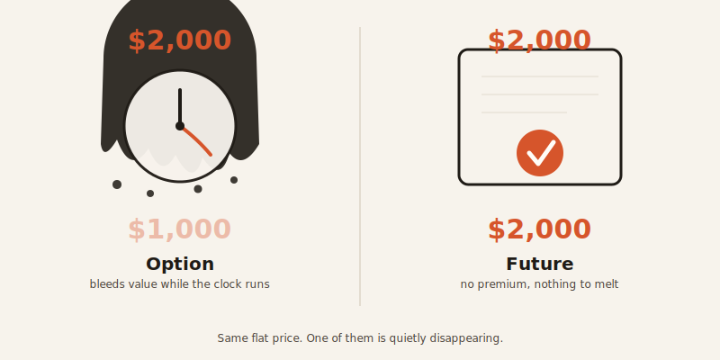
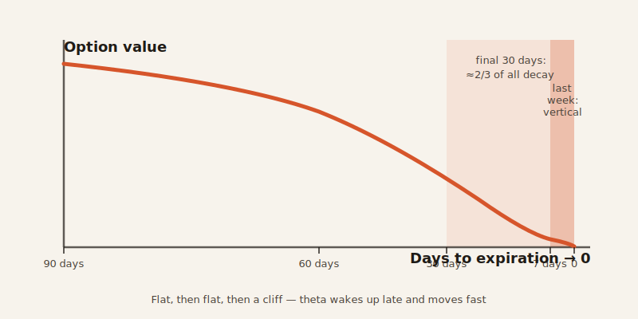
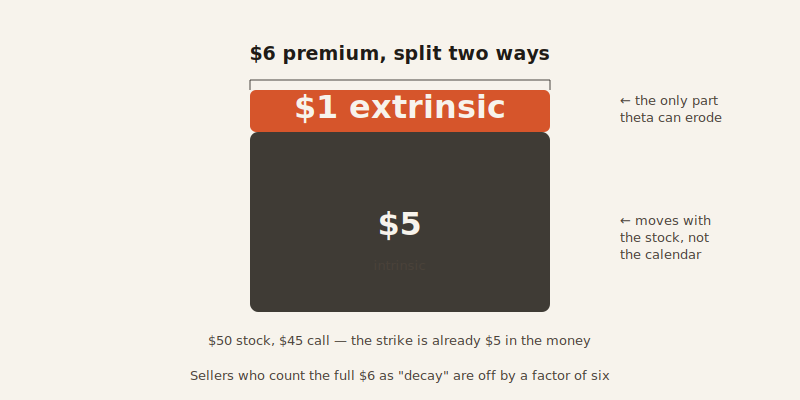

import CompareCard from '../../components/CompareCard.astro';

A $2,000 options position can shrink to $1,000 by lunchtime — and the stock never moved a single cent.

## The concert ticket that explains everything

Say you bought a $50 concert ticket for a show 60 days out. It's worth a little less every day — not because anything happened, just because there are fewer days left for someone else to want it. By day 7 it's down to $10. By day 3, $2. On the morning of the show, it's worth nothing, because the thing it was selling — time before the show — has run out.

You could also *sell* that ticket instead of holding it. Then the decay works for you: every day it loses value, you're the one who already collected the money. That works great, right up until the show gets canceled or moved and you owe the buyer a refund you didn't plan for. Hold that thought — it matters later.

## That's called theta

Theta is the dollar amount an option loses per day purely from time passing — no price movement required. If you buy an option, theta is a bill you pay every single day. If you sell one, it's income you collect every single day.

The options that decay fastest are the ones sitting **at-the-money** (ATM) — meaning the stock price and the strike price are basically the same. Those options carry the most "extra" value on top of their real worth, so they have the most to lose. Options that are deep in-the-money or way out-of-the-money have less of that extra value to begin with, so time barely touches them, even with weeks still on the clock.

## Futures don't play this game at all

A futures contract has no ticket price counting down. There's no upfront premium, no extra value tacked on for "time until it expires" — so waiting costs nothing. An option, by contrast, is what traders call a **wasting asset**: left alone, with the price completely flat, it heads toward zero just from the calendar turning. A future does not.

<CompareCard
  caption="One is a ticking clock. The other just isn't."
  rows={[
    { term: "Time cost", meaning: "Options = bleed value every day (theta) · Futures = zero" },
    { term: "Upfront premium", meaning: "Options = yes, and it decays · Futures = no premium to decay" },
    { term: "Value if price never moves", meaning: "Options = trends toward $0 · Futures = unchanged" },
    { term: "What you're really paying for", meaning: "Options = time + the chance of a move · Futures = just the move" },
  ]}
/>

## The decay isn't a straight line — it's a hockey stick

Theta doesn't drip out evenly across an option's life. It's slow from 90 to 60 days before expiration, close to flat from 60 to 30, then steepens hard in the final 30 days — with the sharpest drop of all in the last week or so. Roughly two-thirds of an option's total time decay happens in that final month.

A 30-day at-the-money SPY call, for example, loses about $0.16 a day to theta. Do nothing else and that's roughly $4.80 gone over 30 days — about two-thirds of the $6–8 you'd have paid for it. Shrink that same option down to 7 days left, and theta only rises to about $0.18 a day — barely more, despite having 76% less time left. The real damage is packed into the last 3 days, not spread evenly across the week.

Push that all the way to a same-day option — what traders call 0DTE, zero days to expiration — and the curve turns vertical. An at-the-money 0DTE option can lose more than half its value in the first two hours of trading, with the underlying stock not moving at all. That's the $2,000-to-$1,000-by-lunch move from the top of this post. Nothing happened. The clock just ran.

## The trap: selling the "juicy" long option

Here's where it gets backwards from what most people assume. A 90-day option costs more upfront than a 30-day one, so selling the 90-day one *feels* like the smarter, richer trade. It isn't — because theta decay runs 2–3 times faster per day in an option's final 30 days than in its first 30. Someone selling 30-day options collects that daily decay roughly 3 times faster than someone parked in a 90-day position.

The trap: you sell the fat 90-day premium, then sit for 60 days collecting almost nothing, because theta hasn't woken up yet. By the time it finally accelerates, you're in the last 30 days — which is also exactly when **gamma** (how fast the option starts reacting to price moves) gets dangerous. You get paid the most right when the ride gets the roughest, and it's usually right when you'd rather be getting out.

## The ITM covered call sleight of hand

Say stock XYZ trades at $50, and you sell the April $45 call for $6. That call is already $5 in-the-money — its strike is below the current price, so $5 of that $6 is value the stock already has, not "extra" value time is going to erase. Only the remaining $1 is the part theta can actually eat.

So even though the option's price might drop by the full $6 over time, you only profit about $1 from theta. The other $5 is intrinsic value, and it moves with the stock, not the calendar. Sellers who think they're pocketing the whole $6 in "decay" are miscounting by a factor of six — which is why rolling or adjusting a covered call like this isn't optional maintenance. It's the only way to actually collect what you thought you were collecting.

## Theta gang, and the seesaw that gets you

"Theta gang" is the name traders give themselves for selling options to "harvest" this decay. Here's the catch: at a fair price, there's no free lunch in it. The premium you collect for selling is the market's going rate for the risk you're taking on — mainly **gamma** (how fast the option reacts to a price jump) and **vega** (how much its value swings when everyone's expectations for future volatility change). You're not finding money. You're getting paid to hold risk, like anyone else who sells insurance.

A concrete version: 17 SPY put credit spreads, $5 wide, sold with 30–45 days left, each contributing +0.01 theta. Add it up and the portfolio earns $17 a day — about $510 over 30 days if nothing else happens. Nothing else happening is the entire bet. One surprise earnings report or Fed announcement spikes volatility, vega losses kick in, and 3 to 6 months of collected theta can vanish in a single day.

That's the seesaw: short options are lovely on quiet days, theta ticking in your favor while you do nothing. Then the market makes one real move, gamma flips vicious, and a week of "free" gains disappears before lunch. The theta burn meme — traders staring at a flat position, watching the number tick down for no reason they can see — is really just people watching a calendar do its job, and somehow being surprised by it every single day.

Theta isn't a strategy. It's a clock. Clocks don't negotiate, and they don't care which side of the trade you're on.
