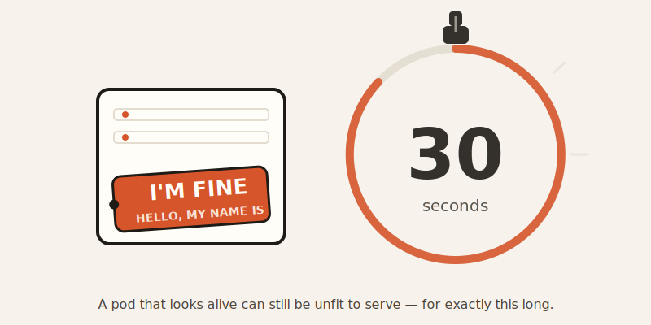

import CompareCard from '../../components/CompareCard.astro';

A pod can lie to Kubernetes for exactly 30 seconds before the lie catches up with it.

## Two questions, not one

Kubernetes doesn't ask your app "are you okay?" It asks two completely different questions, and it's easy to think they're the same question.

**Question one: are you alive at all?** This is the **liveness probe**. If your app fails to answer it — say, three times in a row — Kubernetes assumes the app is frozen or broken beyond repair, and kills the container. Then it starts a fresh one. That's the restart you've probably seen in `kubectl get pods`, the one where the "restarts" column keeps climbing.

**Question two: can you handle traffic right now?** This is the **readiness probe**. If your app fails *this* one, Kubernetes doesn't kill anything. It just quietly stops sending customers your way — pulls the pod out of rotation — until the app says it's ready again.

Same app, two very different consequences for failing the same-sounding question.

## The restaurant that's technically open

Think of a restaurant with a health inspector standing at the door.

The lights are on. Someone answers the phone. That's a liveness pass — the place is alive, no one's shutting it down.

But the kitchen is mid-renovation. No food. Can't seat anyone. That's a readiness fail — so the reservation system quietly stops sending customers there, without condemning the building.

Once the renovation's done, reservations start flowing again. Nobody had to rebuild anything.

But if the building actually burns down — liveness fails — the inspector condemns it and orders it rebuilt from scratch. That's a container restart.

## The math behind the 30 seconds

That 30-second number in the headline isn't arbitrary — it comes from two settings Kubernetes checks by default:

- **periodSeconds: 10** — how often the probe runs (every 10 seconds)
- **failureThreshold: 3** — how many failures in a row it takes to act

Multiply them: `3 × 10 = 30 seconds`. That's the built-in grace period before kubelet (the piece of Kubernetes running on each machine) gives up and restarts the container. It's deliberate — a short blip in your app shouldn't trigger a restart. A sustained, half-minute-long problem should.

There's a third probe worth knowing about too: the **startup probe**. If you configure one, Kubernetes waits for it to succeed before it even starts running the liveness and readiness checks. That's the safety net for apps with a slow, chunky startup — loading a huge file, warming a cache — so the app doesn't get killed for being merely slow to wake up.

<CompareCard
  caption="Same-sounding checks, opposite consequences."
  rows={[
    { term: "Question it asks", meaning: "Liveness = are you alive? · Readiness = can you take traffic right now?" },
    { term: "On failure", meaning: "Liveness = kill and restart the container · Readiness = pull pod from traffic, keep it running" },
    { term: "Container state", meaning: "Liveness fail = gone, replaced · Readiness fail = still running, just benched" },
    { term: "Should check", meaning: "Liveness = is my own process stuck? · Readiness = am I ready to serve requests?" },
    { term: "Should NOT check", meaning: "Liveness should never check external stuff like a database" },
  ]}
/>

## The mistake that makes outages worse, not better

Here's the part that trips people up, because it's backwards from what you'd expect.

Imagine a web app with one `/health` endpoint, and that endpoint checks whether the database is reachable. Sounds reasonable — if the app can't reach its database, something's wrong, right?

Now the database goes down for maintenance. Every pod's `/health` check starts failing. If that single endpoint is wired up as the **liveness** probe, Kubernetes reads this as "all these containers are broken" — and restarts every single one of them. Repeatedly. The new pods boot up, immediately fail the same check (the database is still down), and get killed again. That's an infinite restart loop, self-inflicted, on top of a database outage that had nothing to do with any individual pod being broken.

The fix is almost insultingly simple: split it into two endpoints. `/live` only checks "is my own process responding" — no database, no external calls. `/ready` checks "can I actually serve a request right now," including the database. Wire `/live` to the liveness probe and `/ready` to the readiness probe. Now a database outage benches every pod (readiness fails, traffic stops) without killing a single one of them. When the database comes back, the pods notice and rejoin instantly — no restart storm, no rebuilding from scratch.

The lesson: a liveness probe should only ever ask "is my own process okay," never "is everything I depend on okay." The moment it checks something outside the container's control, you've built a machine that turns other people's outages into your own self-destruction.

## The Docker habit that doesn't carry over

If you're coming from Docker Compose, you might already have a `HEALTHCHECK` line in your Dockerfile and assume it just works in Kubernetes too. It doesn't. Docker's `HEALTHCHECK` reports a status — it never restarts anything on its own. Kubernetes ignores it completely. It only looks at whatever liveness and readiness probes you've defined in the pod spec. Bring over the Dockerfile habit without also writing the probes, and you've got an app with zero actual health checking, even though it looks like you covered it.

## The 6,000-forks-a-minute tax nobody notices

Probes can run four different ways: running a command inside the container (`exec`), an HTTP request (`httpGet`), a raw socket check (`tcpSocket`), or a gRPC call. Three of those are cheap. One of them is a quiet drain on your entire cluster.

`exec` probes work by spawning a whole new process inside the container every single time they run — think `sh -c "curl localhost:8080/health"`. One pod, checked every 5 seconds, isn't a big deal. But 500 pods, each forking a process every 5 seconds, is 6,000 forked processes a minute, cluster-wide, just to ask "you good?" Each fork costs real CPU and memory — and because it's invisible (it's process creation, not your app's own code doing work), teams often only notice after mysteriously losing a fifth of their node capacity to something that isn't in any of their dashboards.

The fix is a one-line swap: use `httpGet` instead of `exec` wherever you can. It's built into the kubelet, forks nothing, and does the same job.

## The short version

Liveness asks "are you alive," and getting it wrong kills things that didn't need killing. Readiness asks "are you ready for traffic," and it's the one that should carry the weight of checking dependencies. Keep them separate, keep liveness dumb and self-contained, and a bad day for your database stops being a bad day for your entire cluster.
