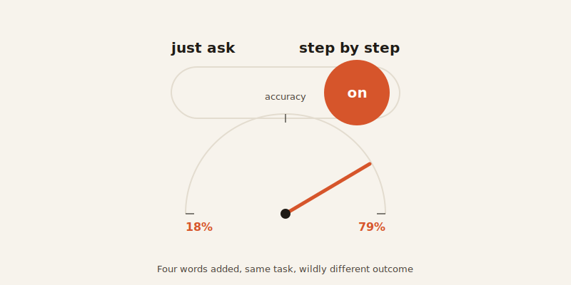
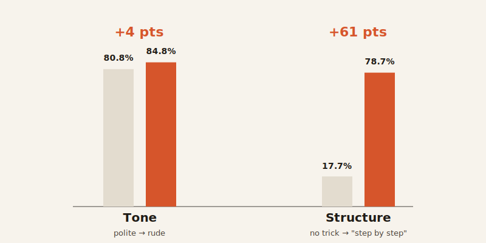

import CompareCard from '../../components/CompareCard.astro';

Four words — "let's think step by step" — took an AI's accuracy on math problems from 17.7% to 78.7%. Same model. Same questions. The only thing that changed was four words added to the front of the prompt.

That's not politeness. It's structure. And it's the real difference between "prompt engineering" and "asking nicely."

## The recipe beats the request

Here's the difference in one comparison. "Preheat the oven to 350°F for 15 minutes, then place the bread on the center rack" is a recipe. "Hey, could you bake this bread if you don't mind?" is a request.

The recipe is rude, in a sense — no "please," no "if you don't mind." But it's precise. It tells you exactly what to do and how long to do it. The polite version is warmer, but it tells you almost nothing.

That gap — precise instructions versus a warm ask — is the entire difference between prompt engineering and asking nicely. One gives the model a structure to follow. The other gives it vibes.

## Politeness has a real, small cost

A 2025 Penn State study put this to a direct test. Om Dobariya, a student at Penn State's Smeal College of Business, and professor Akhil Kumar ran the same 50 questions — spanning math, science, and history — through GPT-4o in five tones, from very polite to very rude.

<CompareCard
  caption="GPT-4o, 50 questions across math, science, and history, five tone variants each. (Dobariya & Kumar, Penn State, 2025, arxiv.org/abs/2510.04950)"
  rows={[
    { term: "Very polite prompts", meaning: "80.8% accuracy" },
    { term: "Very rude prompts", meaning: "84.8% accuracy" },
  ]}
/>

Four points, and the gap held up under statistical testing. Politeness didn't help. If anything, it measurably got in the way.

## The bigger lever is structure

Here's the part that matters more than the "be mean to your chatbot" headline: a four-point gap from tone is small next to what structure can do.

In 2022, researchers at the University of Tokyo and Google tested a simple change: add the phrase "let's think step by step" before asking a language model to solve a problem — no examples, no fine-tuning, just those four words. On a set of grade-school math problems, accuracy jumped from 17.7% to 78.7%. On a harder benchmark, it went from 10.4% to 40.7%.

Same model. Same questions. The only change was giving it a structure to reason inside of, instead of just asking for an answer.

That's roughly a 60-point swing from structure, next to a 4-point swing from tone. If you're looking for where the real lever is, it isn't politeness.

## Structure pays off in cost, too

This shows up outside of accuracy, in plain dollars. Anthropic's prompt caching lets a repeated block of instructions — like a long system prompt — get reused instead of reprocessed on every call. Anthropic reports up to 90% lower cost and 85% lower latency for long, repeated prompts.

Whether that system prompt is written politely or bluntly makes no difference to the savings. What matters is the size and structure of the reused block — the same lesson again: structure is the lever, tone isn't.

## So, should you be rude to your chatbot?

Not really the point. You don't need to be mean — you need to be specific and structured. A blunt, precise instruction beats a polite, vague one, not because rudeness has some magic power, but because structure is what these models are actually built to reward.

Your oven doesn't care if you ask it nicely to preheat. It just needs the temperature and the time.
