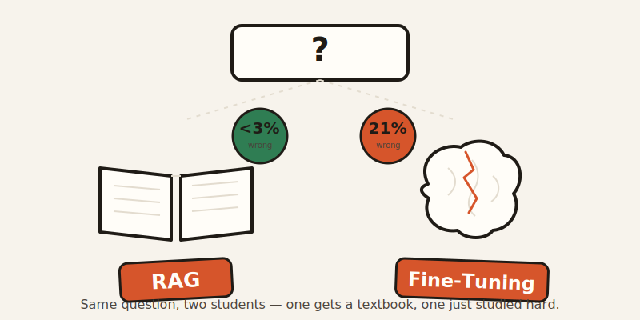
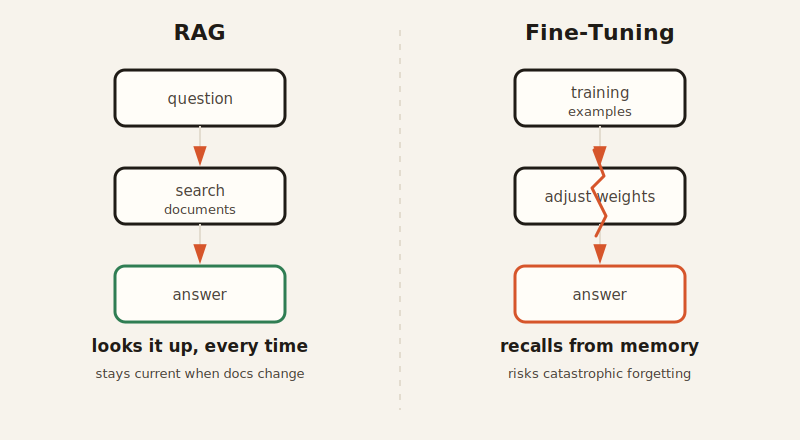

import CompareCard from '../../components/CompareCard.astro';

A fine-tuned AI model, left to answer on its own, gets it wrong about 21% of the time. Give the same kind of question to a model paired with a lookup step, and that number drops under 3%.

## Two ways to teach an AI something it doesn't know

Picture two students before an exam.

One gets to bring a textbook into the room. Every question, they flip to the right page and copy the answer down. That's **RAG** — Retrieval-Augmented Generation.

The other studies the textbook for weeks until the facts move into their head. No book allowed in the exam room — they just have to remember. That's **fine-tuning**.

Same goal — answer correctly. Completely different method. And the second one has a side effect almost nobody warns you about.

## RAG: the open-book exam

Here's what actually happens when a RAG system answers a question.

First, your question gets converted into a list of numbers — an "embedding," somewhere between 384 and 1,536 numbers long. That list is a point in space. Every document in the company's knowledge base has already been converted into its own point, the same way. The system just finds which document-points sit closest to your question-point. Close in this space means "means something similar," even though nobody could draw you a picture of 1,536-dimensional space if their life depended on it. It's math that works better than it has any right to look like it should.

Once the closest documents are found, they get pasted together with your original question and handed to the model in one go. The model answers using both what it already knew *and* the fresh material it was just handed — like a student citing the textbook mid-answer.

The payoff: when the underlying documents change, the answers change with them, instantly, with no retraining. A SaaS company that connected a RAG chatbot to its help docs saw ticket resolution time drop 60% in 30 days, and first-contact resolution rise 40%. When they updated a policy page yesterday, today's answers already reflected it.

## Fine-tuning: studying until it sticks

Fine-tuning works completely differently. Instead of handing the model reference material at question time, you show it thousands of labeled example answers ahead of time, and adjust its internal settings — its "weights" — a little after each one, until it starts producing similar answers on its own. This is called supervised learning, because every example comes with the correct answer attached, unlike the vast, messy, unlabeled internet the model originally learned from.

Doing this to every single one of a model's weights is expensive. A popular shortcut called **LoRA** (Low-Rank Adaptation) instead bolts on a small set of extra, trainable layers — as little as 1–2% of the model's size — and only trains those, leaving the original model untouched underneath. It cuts training compute by 80–90% and keeps 80–95% of the quality of training the whole thing, and at answer time the extra layers merge back in at no speed cost.

Here's the part that surprises people: fine-tuning can make a model *worse*. Researchers call it **catastrophic forgetting** — when a model is fine-tuned hard on one task, it can lose sharpness on things it used to handle fine. The name makes it sound like a malfunction. It isn't. The model is doing exactly what it was told: minimize error on the new examples, as aggressively as possible. Nobody warned it that doing that *well* would come at the cost of everything else it knew. The catastrophe isn't the model breaking the rules — it's the model following them too literally.

## Side by side

<CompareCard
  caption="One brings a textbook. The other tries to memorize it."
  rows={[
    { term: "How it answers", meaning: "RAG = looks it up every time · Fine-tuning = recalls from memory" },
    { term: "Update a fact", meaning: "RAG = edit a document · Fine-tuning = retrain the whole model" },
    { term: "Hallucination rate", meaning: "RAG = under 3% · Fine-tuning alone = 21%" },
    { term: "Risk", meaning: "RAG = bad retrieval, confident nonsense · Fine-tuning = catastrophic forgetting" },
    { term: "Build cost", meaning: "Roughly comparable upfront · gap shows up later, in scaling" },
  ]}
/>

## When the open-book student answered wrong anyway

RAG isn't immune to failure — it just fails differently. Air Canada's support chatbot once told a grieving passenger he could claim a bereavement fare discount if he applied within 90 days of travel. That policy didn't exist. The airline retrieved (or generated from) the wrong document, answered confidently, and got taken to tribunal over it — the passenger was owed $812.02 plus fees, and won.

Nothing stopped the answer from going out low-confidence and unchecked. There was no gate saying "we're not sure enough about this one, don't answer." Some teams find that gap by reading angry customer feedback. Air Canada found it in court.

## The scoreboard: what it costs at scale

Below about 100,000 interactions a month, RAG is the cheaper option — you're paying for lookups, not retraining runs. Past 200,000 interactions a month, a fine-tuned smaller model can run 70–90% cheaper per interaction, because you're no longer paying an API to reason over pasted-in documents every single time.

LinkedIn built a RAG system for customer service that also tracks relationships between past issues, and cut median per-issue resolution time by 28.6%. At their volume, RAG with API access runs around $30K. Below 100K interactions a month, that math favors RAG outright; the crossover only flips once volume gets big enough that the per-call cost of "search, then reason" starts outweighing the cost of training a smaller model once and running it cheaply forever after.

Even the fine-tuning side has a cheap lane: OpenAI charges $3 per million tokens to fine-tune GPT-4.1, or $0.80 per million on the mini version — a fraction of a full custom training run.

## The plot twist nobody planned

Teams that run either system in production long enough tend to land in the same place. After about twelve months, independently, without comparing notes, they converge on the same setup: fine-tune the model a little for *style and tone*, and retrieve the actual *facts* at question time. Everyone building their own version thought they'd invented something different. They'd all just rediscovered the same split — memory for how to talk, a lookup for what to say.

## So which do you actually pick?

Wrong framing, honestly — but here's the real answer anyway. If your facts change often (policies, prices, docs, anything with a "last updated" date), RAG wins: it never needs retraining, and it stays under that 3% hallucination line as long as retrieval is working. If your facts are stable and your volume is enormous, fine-tuning starts paying for itself in raw inference cost. And if you're not sure yet, that's fine — most teams don't start with the hybrid, they arrive at it, one production incident at a time.
