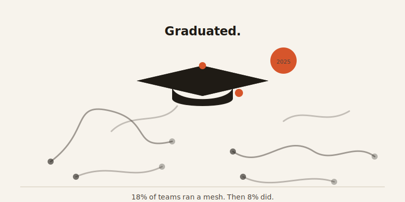
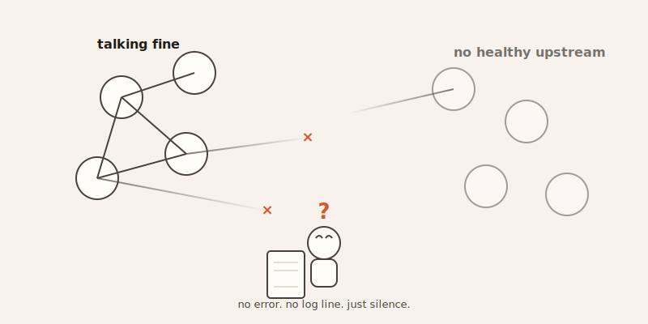

import CompareCard from '../../components/CompareCard.astro';

The year Istio graduated into the Cloud Native Computing Foundation — the industry's official stamp of "this is grown-up, production-ready software" — the share of teams actually running a service mesh fell from 18% to 8%.

## Okay, but what even is a service mesh?

Picture a company with a hundred small teams, each running their own little service — one handles logins, one handles payments, one handles the shopping cart. They all need to talk to each other constantly. And every single one of those conversations needs the same handful of things: is the other service even alive? Should this traffic be encrypted? If a request fails, should we retry it?

You could write that logic into every service, by hand, a hundred times. Or you could hand every service a personal assistant who handles all of it invisibly, so the actual app code never has to think about it. That assistant is called a **service mesh**.

## The sidecar: a silent assistant riding along with every service

The way a service mesh actually works is almost sneaky. Next to every single service, it drops in a small helper program called a **sidecar proxy**. Every bit of network traffic going in or out of that service passes through its sidecar first — quietly, without the app itself knowing it's there.

The app thinks it's just talking to the network like normal. It isn't. It's talking to its sidecar, and the sidecar is doing the actual work: checking whether the destination is healthy, retrying if something fails, encrypting the message, before ever letting it out the door.

## Two brains: a control plane that plans, and a data plane that acts

Here's the analogy that makes this click: think of a sports team. The coaching staff sits above the field, deciding plays and formations — that's the **control plane**. The players on the field are the ones actually running those plays — that's the **data plane**.

The coaching staff never touches the ball. They just send instructions down. Each player has a silent assistant (their sidecar) relaying what the coach wants, in real time, without ever interrupting the game. Translated back to computers: the control plane sends configuration and policy to every sidecar; only the sidecars ever touch real traffic. The control plane just plans.

## The price tag, in real numbers

None of this is free. Every request now takes a detour through a sidecar on the way out and another on the way in, and that costs a sliver of time and a slice of the machine's memory.

<CompareCard
  caption="Istio does more, and it costs more to run it."
  rows={[
    { term: "Extra latency (typical load)", meaning: "Istio ≈ 1.7ms p90, 2.7ms p99 · Linkerd ≈ 0.9–1.2ms" },
    { term: "Extra latency (2,000 RPS)", meaning: "Istio ≈ +17ms median · Linkerd ≈ +6ms median" },
    { term: "Per-pod overhead (per 1,000 RPS)", meaning: "Istio ≈ 0.20 vCPU, 60MB · Linkerd's microproxy ≈ 100mCPU, 10MB" },
    { term: "Control plane memory", meaning: "Istio ≈ 1GB+ (often 2GB in production) · Linkerd ≈ 200–300MB" },
  ]}
/>

At normal traffic levels, none of that is something a user would ever notice. But it doesn't stay flat — Istio's own numbers show latency climbing 166% once you push it to 3,200 requests per second. The tax scales with your success.

## What you get for that price: encryption nobody had to write

In exchange, every pod-to-pod conversation gets encrypted and identity-checked automatically — no application code changes required. That's called **mTLS**, and normally getting every service in a company to speak it correctly, by hand, is slow and easy to get wrong. A service mesh just turns it on everywhere, for everyone, at once.

That's genuinely the pitch: retries, encryption, health checks, and traffic control, all without touching a single line of app code. Which makes the 18%-to-8% collapse stranger, not less strange — the thing works exactly as advertised.

## Rappi grew from $100M to $8B and outgrew its home-made version

Rappi, the Latin American super-app, is the case study for why teams reach for this in the first place. As the company scaled from $100M to an $8B business running 50+ Kubernetes clusters, their own in-house, hand-rolled version of this plumbing became unmaintainable. They switched to Istio, and the scaling pain that had been slowing them down went away.

That's the mesh working as designed. So what's actually behind teams walking away?

## The part that actually explains the 18% → 8% drop

Ask anyone who's run a service mesh in production and they'll bring up the same error eventually: **"no healthy upstream."** It shows up in the logs constantly, it usually just means a small config mistake somewhere — and tracking down exactly where means wading into the internals of Envoy, the proxy engine underneath, which is a layer of the stack most engineers never wanted a personal relationship with.

Worse than the errors that do show up are the ones that don't. A misconfigured policy can silently drop traffic — no error, no log line, nothing. Just half the cluster suddenly unable to talk to itself, and no clue why. Engineers describe debugging it as "reading a novel in a foreign language while the building is on fire" — the tool that was supposed to add visibility ends up creating its own debugging problem, on top of the one you already had.

And it cuts both ways. Roll out a feature — a retry rule, a circuit breaker, mTLS — across your entire fleet with zero code changes, and it works, instantly, everywhere. Roll out one misconfigured policy, and it breaks your entire fleet just as instantly, with no application code to point at as the culprit. The tool is powerful exactly because it sits underneath everything. That's also why, when it goes wrong, there's nowhere obvious to look.

## The industry's actual fix: get rid of the sidecar

The people building this software didn't just watch the adoption numbers drop and shrug. In 2024, Istio's **Ambient mode** reached general availability — a version of the mesh that does away with sidecars entirely. If the sidecar was the thing adding latency, eating memory, and creating a whole extra layer to debug, the fix wasn't to explain it better. It was to remove it.

That's a pretty rare thing for a piece of infrastructure to admit: the core architectural idea that defined the category for years was also the category's biggest complaint.

## So should you actually run one?

Wrong question if you're a small team with a handful of services talking to each other in predictable ways — that setup doesn't need a coaching staff, a translator, and a security guard bolted onto every single connection. The mesh earns its keep once you're Rappi's size: dozens of clusters, teams that can't coordinate on shared plumbing by hand anymore, and a genuine need for uniform encryption and traffic policy across all of it. Below that line, you're paying the sidecar tax for problems you don't have yet. Above it, the tax is the cheapest thing on the list.
