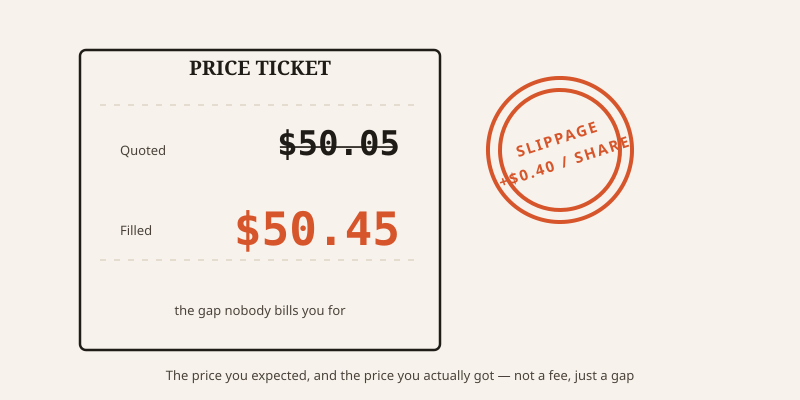
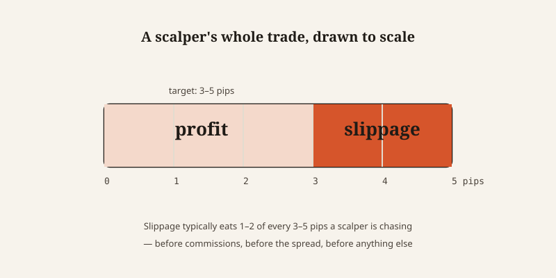

import CompareCard from '../../components/CompareCard.astro';

A trader scalping 3 to 5 pips of profit per trade, a hundred times a month, can lose $36,000 a year to a cost that never once shows up as a line item on any statement.

## It's not a fee. Nobody's collecting it.

Open a ride-share app. It quotes you $25 to get home. You tap "request." By the time the booking confirms, three seconds later, demand ticked up and the price is now $30.

You didn't get scammed. Nobody pocketed the extra $5. The price just moved in the gap between when you looked and when the system locked it in.

That gap is slippage: the difference between the price you expected and the price your trade actually executes at. In trading, that gap can be milliseconds instead of seconds — but the mechanism is identical. You see a price. The world doesn't hold still while you click.

## Why the gap exists at all

Two things cause it, and both are just physics of markets, not malice.

**Time.** Between you clicking "buy" and the order actually landing, the price can move. On a stock exchange that's milliseconds. On a blockchain, where a transaction has to be confirmed, it can be seconds to minutes — plenty of time for the price to drift.

**Size.** Big orders move the market themselves just by showing up. This is especially visible on crypto exchanges that use automated pricing curves instead of order books: a large trade has to "slide" further up the curve to find enough liquidity, and the price moves more the further it slides. A small pool of available coins makes this worse. A deep one makes it milder.

Slippage isn't always against you, either. A buy that fills lower than quoted is slippage in your favor. Most traders never notice the good kind — it just feels like luck — and only remember the bad kind, which is why slippage has a reputation as a one-way tax.

<CompareCard rows={[
  { term: "Negative slippage", meaning: "Fills worse than quoted — you notice this one" },
  { term: "Positive slippage", meaning: "Fills better than quoted — quietly forgotten as \"good luck\"" },
]} caption="Same mechanism, opposite direction. Only one half gets remembered." />

## The math that doesn't survive contact with reality

Here's where it stops being an abstraction.

A trader buys a stock at 9:30 AM on earnings day. The quote says $50.05. By the time the order actually fills, the stock has gapped to $50.45 on a liquidity crunch. That's $0.40 a share of slippage — 0.8% on a $50,000 position, or a $400 loss on a single trade that, on paper, should have cost nothing extra at all. On volatile news events, slippage regularly runs 5 to 100 pips.

Now stretch that across a strategy built on thin margins. A scalper targets 3 to 5 pips of profit per trade on a liquid forex pair. Slippage typically eats 1 to 2 pips of that per trade. Do the arithmetic on 100 trades a month at $10 a pip, averaging 3 pips of slippage: that's $3,000 a month, gone. Over a year: $36,000. On a strategy that was supposed to be profitable.

A swing trader with a strategy built around a 1.5-to-1 risk-reward ratio, taking 50 trades a year, assumes they clear commissions and spreads and come out ahead. Add 2 unaccounted pips of slippage per trade, and that 1.5-to-1 setup quietly becomes 1.3-to-1 in real execution — enough to turn a marginally profitable system into one that just treads water, or loses.

None of this shows up as a fee on a statement, because it isn't one. It's not the spread, which goes to a market maker. It's not commission, which goes to a broker. It's not tax, which goes to a government. It's just gone — vanished into the seconds between "I want this price" and "this is the price I got."

## Crypto adds a bot that's hunting you specifically

On a blockchain, the confirmation delay that causes slippage isn't just an unlucky gap — it's a window other people can see into and act on. Bots watch the queue of pending transactions, spot a large pending buy, buy the same asset first, let the original trade push the price up into them, then sell right after. This is called a sandwich attack, and the "slippage" that costs you is, for someone else, the entire business model.

The fix seems obvious: set a tighter slippage tolerance, so your trade won't execute at a worse price than you're willing to accept. Except tighten it too far — say, from 3% down to 0.1% — and your transaction just fails outright with a slippage error, over and over, until you either loosen it back up or give up. Loosen it, and you're exactly the kind of order those bots are watching for.

There isn't a setting that avoids both. You're choosing between paying to be sandwiched or paying (in failed transactions and gas) to get nowhere.

## The strategy that only works on paper

The place slippage does the most damage is invisible until it's too late: backtesting. When a trader simulates a strategy against historical prices, the simulation usually assumes trades fill at the exact price on the chart, instantly, with no friction. Reality doesn't work that way, and the gap between the two is large — slippage alone is estimated to eat 60 to 80% of the total transaction costs institutional traders actually incur.

This is exactly how arbitrage bots die. The spreadsheet says a 1% profit on some ETH/DAI price gap between two exchanges, arithmetic so simple it looks unbeatable. Deployed live, slippage on each leg of the trade runs 1.2 to 1.5% — bigger than the entire edge the bot was built to capture. Every trade loses money, and the "bulletproof" 1% strategy has to be paused the moment the market gets even a little volatile.

Slippage isn't a rare event that occasionally derails an otherwise-solid plan. It's a cost that's present on every single trade, whether or not anyone bothers to measure it — which is exactly why the systems that ignore it look flawless right up until they're run with real money.
