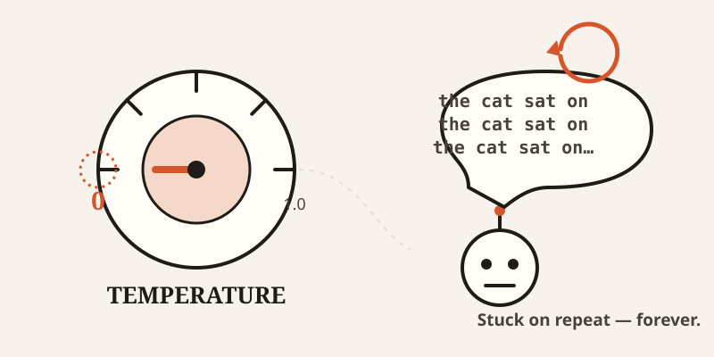
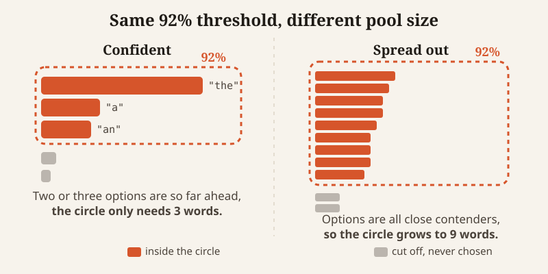

import CompareCard from '../../components/CompareCard.astro';

Turn an AI's "randomness" all the way down to zero, expecting the safest, most predictable answer. Instead, it gets stuck. Same phrase, over and over, forever.

That's not a bug report. That's just what happens when you crank temperature to its lowest setting. To understand why, you have to understand what temperature and its quieter cousin, top-p, are actually doing under the hood.

## The model is basically finishing your sentence

Every time an AI writes a word, it isn't "deciding" anything the way a person does. It's ranking every possible next word by how likely it is to come next, then picking one from that ranked list.

Left alone, it would almost always grab the single most likely word. Every time. That sounds like it should produce the *best* possible writing. In practice, it produces something bland and weirdly repetitive — the text version of a person who only ever says the most obvious thing in every conversation.

Temperature and top-p are the two knobs that stop that from happening, by changing how the AI picks from its list of "next word" candidates.

## Temperature: a volume knob for randomness

Think of temperature as a volume knob on a speaker who has a list of possible next sentences ranked by how natural they sound.

Turn the volume to 0, and they don't get careful — they get stuck. They robotically repeat the same phrase forever, because it's still (barely) the most likely thing to say next, so they say it again. And again.

Turn it up to a medium setting, and they pick naturally from the options that make sense, the way a person actually talks.

Turn it up too high, and they start blurting out nonsense — technically still "possible" words, just not sensible ones.

Most APIs let temperature run from 0.0 to 1.0, with 1.0 as the standard default. The common advice is to push it toward 0 for analytical or multiple-choice-style tasks, and toward 1 for anything creative.

## The paradox: the "safest" setting is the broken one

Here's the part that trips people up. Temperature 0 sounds like it should mean "no randomness, maximum control." What it actually means is: always pick the single most likely next word, no matter what.

That's called greedy decoding, and it has a well-known failure mode — it loops. If "the" is slightly more likely to follow "the cat sat on" than anything else, and then something else becomes slightly more likely to follow *that*, the model can walk itself right back into a repeating cycle and never find a way out.

So the dial that looks like "off" is actually the one most likely to break. A medium setting, which feels like it's introducing risk, is often *more* stable than turning the randomness all the way down.

<CompareCard
  caption="What each end of the temperature dial actually does"
  rows={[
    { term: "Temperature → 0", meaning: "Always picks the top word — same repetition trap as greedy decoding" },
    { term: "Temperature → medium", meaning: "Picks naturally among likely options" },
    { term: "Temperature → high", meaning: "Starts picking words that don't really fit" },
  ]}
/>

## Top-p: drawing a circle instead of turning a dial

Top-p, also called nucleus sampling, solves a different problem: temperature reshapes the *whole* list of possible words, but it doesn't change how long that list is.

Picture drawing a confidence circle around the speaker's top candidate sentences — say, the smallest group that together covers 92% confidence — and letting them pick only from inside that circle. Everything outside the circle, the genuinely unlikely stuff, never gets a chance.

The clever part is that the circle isn't a fixed size. Sometimes reaching that 92% threshold only takes the top 3 words, because one or two options are overwhelmingly likely. Other times it takes the top 9 or more, because the possibilities are more spread out. Top-p adjusts the pool automatically instead of using a fixed number of options every time.

That adaptiveness is exactly what a fixed cutoff can't do. A rule like "always consider exactly the top 5 words" would sometimes include obvious nonsense (when only 2 options actually make sense) and sometimes cut off perfectly reasonable choices (when 8 options are all close contenders).

## Why any of this is necessary at all

Here's the genuinely strange part. The model was trained to predict the most likely next word. That's the entire job it was trained for. And yet, if you let it do that job perfectly — always picking the most likely word — you get worse writing, not better.

Researchers studying this found that text generated by always picking the top choice comes out "bland and strangely repetitive," even though the underlying model is the same one that can produce genuinely good writing under different settings. The decoding strategy — how you pick from the list — turned out to matter as much as the model itself.

So temperature and top-p aren't fixing a broken model. They're deliberately making a well-trained model *ignore* part of what it learned, on purpose, because pure obedience to its own training produces text that's technically correct and practically boring.

## So what do you actually do with these dials

Neither setting is "the good one." They're doing different jobs, and most tools let you use both together.

For anything analytical — answering a factual question, picking one of several fixed options — push temperature low and keep top-p tight. You want the obvious, most-supported answer.

For anything creative — brainstorming, varying your writing style, generating options — push temperature higher and let top-p's circle open up. You're intentionally inviting in choices the model wouldn't have made on its own.

Just don't push temperature all the way to zero expecting "safe." Zero isn't safe. Zero is the setting where the model gets stuck agreeing with itself, over and over, until you stop it.
