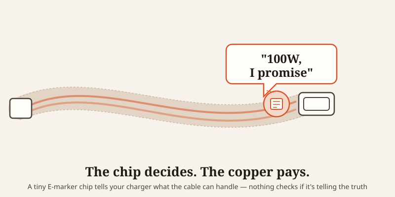
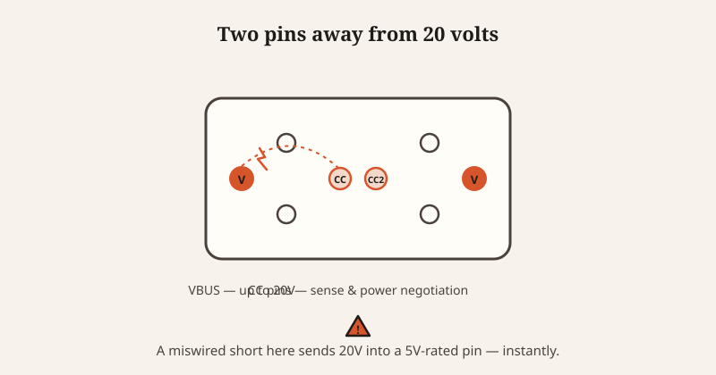

import CompareCard from '../../components/CompareCard.astro';

Somewhere inside your charging cable there's a tiny chip whose entire job is to tell your charger how much power the cable can safely handle — and on a lot of cheap cables, that chip is programmed to lie about it.

## The cable that bricked a Google engineer's laptop

In 2016, a Google engineer named Benson Leung plugged an ordinary-looking USB-C cable, bought off Amazon, into his Chromebook Pixel. The laptop stopped booting. Completely.

The cable was wired wrong in a way the USB-C spec explicitly forbids — missing a small internal component the standard requires — and that mistake made the laptop draw way more current than it was supposed to. Leung got curious, bought hundreds more USB-C cables under the username "LaughingMan," and tested them one by one. Non-compliant cables turned out to be everywhere. Amazon eventually banned the worst offenders from sale.

Here's the part that should worry you: from the outside, the cable that killed his laptop looked exactly like every other cable. Same plug, same braided sleeve, same "works with everything" sticker. The failure was invisible until it wasn't.

## USB-C cables are supposed to introduce themselves

USB-C isn't just a wire anymore. Any cable rated to carry more than 3 amps of power has to contain a small chip — called an E-marker — that talks to your charger the instant you plug in. It reports the cable's current limit, voltage rating, and data speed, and your charger uses that report to decide how much power it's safe to send.

That's a smart system, in theory. In practice, it means your charger isn't measuring the cable at all. It's just trusting whatever the chip tells it.

And a chip is just a few lines of programmed firmware. Nothing stops a manufacturer from programming it to say "100 watts, no problem" while the copper wire running the actual current is thin enough to overheat at a fraction of that load. When your charger negotiates that much power, it asks the chip what's safe — and the chip's word is the only thing standing between 100 watts and a wire that can't take it.

## The wire doesn't care what the chip says

Wire thickness is measured in AWG (American Wire Gauge) — smaller numbers mean thicker wire. A proper 5-amp cable needs 20 AWG copper, thick enough to carry that current without dangerously heating up. A lot of cheap cables use 28 AWG instead — thin enough that sustained current above roughly 2 amps starts pushing it into overheating territory.

Swap in an E-marker chip that claims 100 watts, keep the thin wire, and you've built a cable that tells your charger to send far more power than the copper inside can actually survive.

<CompareCard
  rows={[
    { term: "What a real 5A cable uses", meaning: "20 AWG copper — thick enough to carry the current safely" },
    { term: "What many cheap cables use", meaning: "28 AWG copper — thin, realistically safe only near 2A" },
    { term: "What the chip is capable of claiming", meaning: "Whatever the manufacturer programs — including specs the wire can't back up" },
    { term: "Who verifies the chip is telling the truth", meaning: "No one, in the moment — your charger just takes its word for it" },
  ]}
  caption="The spec lives in software. The wire is still just copper."
/>

## It can also just stop working, three feet later

Even when a cable isn't dangerous, it can quietly get worse the farther it stretches. Thin wire has more electrical resistance, and resistance eats voltage over distance. Run 1 amp through 5 meters of thin 26 AWG wire and the voltage can drop by roughly two-thirds of a volt — enough to dip below the minimum a device needs to charge properly. The charger responds by quietly downgrading to slow charging, or giving up on the connection entirely.

Which is why a cable that charges your phone fine on your nightstand can mysteriously stop working when you run it across the room. It's not haunted. It's Ohm's law.

## The two pins that make USB-C flip-fine but also risky

Part of what makes USB-C great is that you can plug it in either way up — no fumbling to find the right orientation. That trick relies on two small "Configuration Channel" pins sitting right next to a line carrying up to 20 volts of power. If a cable is miswired or damaged in just the wrong way, it can short that 20-volt line straight into circuitry built for 5 volts — frying the charging port or the power controller on contact.

The same design that makes the cable convenient is the design that makes a bad cable dangerous. There's no version of USB-C that gets the flexibility without also inheriting the risk.

## How often does this actually happen?

More than you'd hope. Apple's own 2016 investigation into chargers being sold as genuine on Amazon found that nearly 90% of them were counterfeit. When Trading Standards tested 400 of those fake Apple chargers for basic electrical safety, only 3 had enough insulation to be considered safe. That's a 99.25% failure rate on the single most basic requirement — not catching fire.

Cables aren't much better. Independent lab testing has found that 37% of non-certified USB-C cables sold on major marketplaces violate basic safety requirements — missing E-marker chips, thin wire sold under a thicker wire's label, or CC pins wired incorrectly.

## The "conspiracy" isn't a conspiracy

Nobody is secretly plotting to hurt you with a phone cable. What's actually happening is simpler and, in its own way, funnier: USB-C was built to be reversible, powerful, and able to auto-negotiate its own specs — and every one of those features depends on trusting a report the cable gives about itself. Official, certified cables have to earn that trust. Cheap ones just skip the parts that cost money and program the chip to say whatever sounds impressive.

A cheap cable can look, feel, and even charge exactly like a certified one — right up until the moment it doesn't. The only real defense is buying from brands that bother with certification, because your charger certainly isn't going to catch the lie for you.
