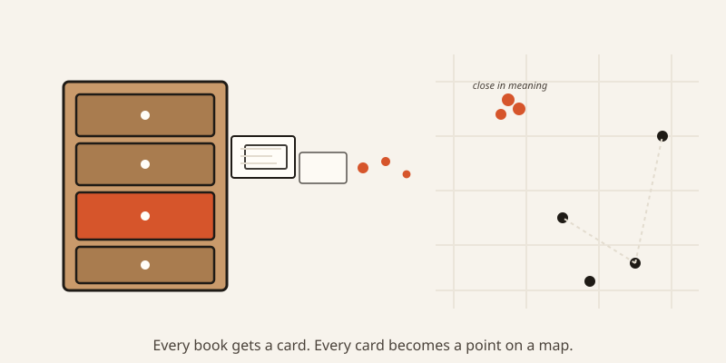
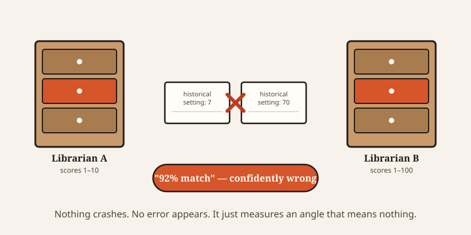

import CompareCard from '../../components/CompareCard.astro';

One of OpenAI's embedding models can describe any sentence you give it using 3,072 numbers. Shrink that list all the way down to 256 numbers — a thirteenth of the size — and it only gets 11% worse at its job.

## What's actually in those numbers

Picture a librarian who refuses to describe any book with just one word. Instead, every book gets a card with dozens of attributes filled in: genre, tone, pacing, vocabulary level, historical setting, how sad the ending is, how much it resembles a spy novel versus a romance. Hundreds of little scores, all on one card.

Now a reader walks up and asks, "what's something like this book I just finished?" The librarian doesn't search titles. She pulls out the new book's card, and starts comparing it to every other card in the drawer, looking for the ones whose scores line up closest.

That's a vector embedding. Text (or an image, or a product listing) gets converted into a long list of numbers — anywhere from 256 to 3,072 of them, depending on the model. Each number is a learned attribute, the same way each line on the librarian's card is an attribute. Two pieces of text that mean similar things end up with similar lists of numbers — close together, like two cards with matching scores.

## Why "close" beats "exact"

This is the part that makes the whole system useful: it never needs an exact match.

Old-fashioned search looks for the same words. Ask about "a doctor's income" and it won't find a document about "physician compensation" unless someone thought to type both. Embeddings don't care about exact wording — they care about position. "Doctor's income" and "physician compensation" land in almost the same spot on the card, because they mean almost the same thing, even though they don't share a single word.

There's an old linguistics idea behind this, from 1957: a word is known by the company it keeps. Words that show up in similar sentences tend to mean similar things. Embeddings are that idea turned into math — measured with something called cosine similarity, which is really just the angle between two lists of numbers. Smaller angle, closer meaning.

## Shrinking the card without losing the point

Here's where the opening number comes back. A full-size embedding from OpenAI's text-embedding-3-large model uses 3,072 numbers per piece of text by default. That's a lot of storage, multiplied across every document, every product, every support ticket a company has.

Trim it down to 256 numbers — a card with a thirteenth as many lines filled in — and search quality only drops about 11%, while storage needs shrink 4 to 8 times over. Most of what makes two pieces of text similar or different survives in a much smaller card than you'd expect. The rest turns out to be a rounding error.

<CompareCard
  caption="Same idea, wildly different scale."
  rows={[
    { term: "Pinecone, 1 billion vectors", meaning: "~50ms per answer, 10,000 questions per second" },
    { term: "Milvus, 10 million vectors", meaning: "~20ms per answer, but needs 64–96 processors and up to 220GB of memory to keep up" },
  ]}
/>

## The part that fails without telling you

Here's the twist nobody warns you about until it's already happened.

You cannot mix cards from two different librarians. If one librarian scores "historical setting" from 1 to 10 and another scores it from 1 to 100, comparing their cards directly is meaningless — even if both cards happen to have the same number of lines on them.

Embedding models work the same way. Two different models can both output 1,536 numbers per piece of text, and their number-spaces can still be completely incompatible — built from different training data, different scoring habits, different everything. Embed half your documents with one model and half with another, then search across both, and you get answers. Just wrong ones. Nothing crashes. No error appears. The system doesn't know it's comparing a card scored out of 10 against a card scored out of 100 — it just measures the angle and reports a confident, meaningless result.

This is why swapping an embedding model in production is treated as a major event, not a config change. Every existing document has to be re-scored by the new librarian and the whole index rebuilt from zero. There's no shortcut that translates one model's numbers into another's — the spaces just don't line up.

## The bias that's baked into the geometry

Embeddings learn their attributes from huge piles of human writing, which means they also learn what humans happen to associate together — including the ugly parts.

The clearest example: in the resulting number-space, "man" relates to "doctor" the same way "woman" relates to "nurse." Ask an embedding model to fill in occupations and women cluster near receptionist, waitress, flight attendant; men cluster near programmer, engineer, doctor. Look at which adjectives sit nearest to each gender, and it gets worse — words near "woman" skew toward appearance ("gorgeous," "attractive"), while words near "man" skew toward intelligence ("clever," "brilliant"), by a roughly 76% margin.

Nobody coded that in on purpose. It's not a bug sitting in one line you could delete — the bias is smeared across the entire number-space, the same way a scent soaks into every card in a drawer that's been stored near a candle. There's no single line to cross out.

## The map that goes stale

One more quirk, quieter than the others: embeddings don't update themselves.

If a model learned in 2020 that "Twitter" clusters near "social media," it will keep believing that forever unless someone retrains it — even after the platform changes name, ownership, and half its meaning in the culture. The model isn't wrong about anything it was taught. It's just describing a world that's moved on, the way an old paper map still shows a highway that got rerouted years ago. It'll keep giving you directions with total confidence. They just won't get you there anymore.

That's the whole trade embeddings make: turn meaning into something you can measure, at the cost of everything that measurement quietly leaves out.
