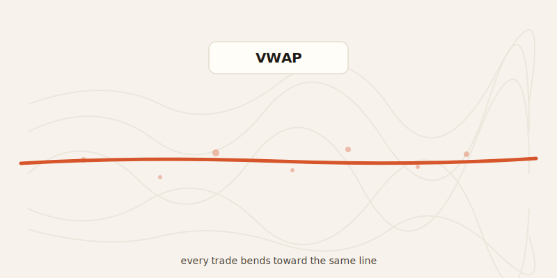
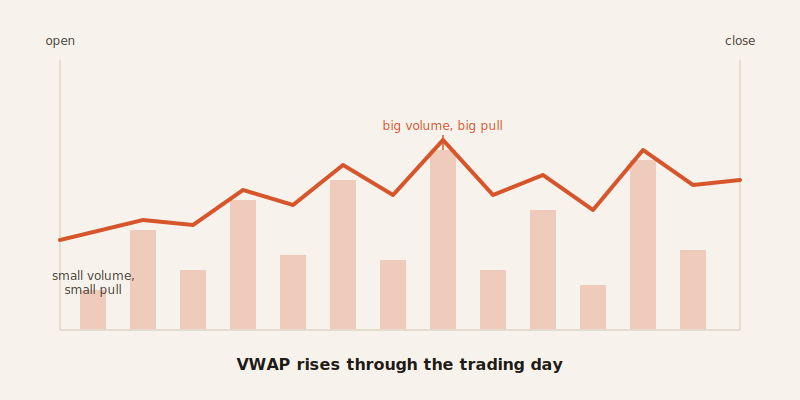
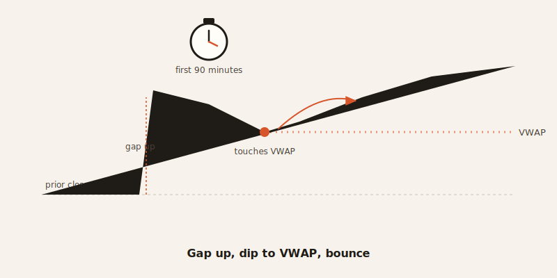

import CompareCard from '../../components/CompareCard.astro';

In 1984, someone built a grading system to check how well one pension fund's trades went. Today, that same grading system quietly steers around $8.7 billion of stock trading a day.

## What VWAP actually is

VWAP stands for Volume-Weighted Average Price. Ignore the name for a second and picture a classroom instead.

A teacher wants the class average grade, but she weights it by how much homework each student actually turned in. A kid who submitted 50 assignments pulls the average toward their grade 50 times harder than a kid who submitted one. That's it. That's VWAP. Swap "grade" for "price" and "assignments submitted" for "shares traded," and you've got the whole idea.

A stock that trades 10 million shares at $50 matters a lot more to VWAP than the same stock trading 100,000 shares at $50. Big volume, big pull. Small volume, small pull.

## How it's built, in plain terms

VWAP starts fresh every single trading day. It resets to zero at market open and builds up minute by minute until the closing bell — then it's gone, meaningless by tomorrow morning. Comparing today's VWAP to yesterday's is like comparing this week's class average to last week's. Different students, different homework, different number entirely.

On the very first price tick of the day, VWAP just equals the price itself — there isn't enough volume history yet for any weighting to kick in. From there, every new trade nudges the running average, weighted by its own size.

## Why a pension fund needed this at all

Say a pension fund needs to buy 1 million shares of Apple. Dumping all million shares into the market in one shot would spike the price against itself — the fund would be bidding against its own order, paying more with every share. That's an expensive way to trade.

So instead, a VWAP algorithm slices the order into hundreds of small pieces and times them to match how Apple normally trades throughout the day. The trader running that order gets graded on how close their average price landed to the day's VWAP. Land above it on a buy order, and they overpaid — measured in basis points, a unit that just means one hundredth of a percent. On average, that gap runs about 2.3 basis points for large companies and 5.7 for smaller ones.

<CompareCard
  caption="The vocabulary, decoded."
  rows={[
    { term: "VWAP", meaning: "Average price, weighted by how many shares traded at each price" },
    { term: "Typical price", meaning: "(High + Low + Close) divided by 3, for a given period" },
    { term: "Basis point", meaning: "One hundredth of a percent — a tiny sliver used to measure trading cost" },
    { term: "Anchored VWAP", meaning: "The same math, but started from a chosen date instead of market open" },
  ]}
/>

## The accident that became the standard

Here's the part that makes VWAP genuinely funny once you know it: nobody set out to build the industry's benchmark. In 1984, a broker named James Elkins, working at a firm called Abel Noser Corp, built this calculation to measure one client's trading performance — the client was Ford Motor Company's pension fund. It was a report card, not a product.

Roughly 20% of all algorithmic stock trading — around $8.7 billion a day — now runs on VWAP. And the reason isn't that someone decided it was the best idea. It's that big funds are *forced* into VWAP-shaped trading whether they like the benchmark or not, because slicing a giant order to match the market's natural volume curve is the only way to buy or sell that much stock without wrecking the price yourself. The measuring stick and the survival strategy turned out to be the exact same math. Everyone converges on it not because they were told to, but because the alternative is self-inflicted damage.

## Traders pin it to specific moments

VWAP doesn't have to start at market open. Traders sometimes "anchor" it to a date that matters instead — an earnings report, a big news event — to track where big money has been building or unloading a position since then. Microsoft is a real example: a VWAP anchored to late 2022 kept acting like a floor through 2023 and into 2024, with the price repeatedly bouncing off that line during pullbacks.

There's a narrower version of this too. When a stock gaps up more than 3% at the open, its first pullback down to VWAP within the first 90 minutes has historically reversed back upward about 65% of the time. But push that gap past 10%, and the edge disappears — the stock has moved so far, so fast, that the day's VWAP stops being a meaningful line to react to at all. A trader has to re-anchor VWAP to the gap itself for it to mean anything.

## The part that's genuinely absurd

Retail trading education teaches roughly eight different VWAP strategies — crossovers, breakouts, trend-following, and so on. Research checking all eight found that every single one produces zero edge or a negative one. So a retail trader learning VWAP purely from online content has a 7-in-8 chance of picking a strategy that actively works against them, and the one approach that isn't losing money isn't the one being taught.

Meanwhile, institutional traders are doing something oddly synchronized: 67% of their limit orders on major exchanges sit within just 10 basis points of the current VWAP. That's an unnaturally tight cluster for supposedly independent trading desks — it looks less like coincidence and more like everyone quietly checking the same signpost.

There's even a reason the edge in extreme VWAP deviations hasn't been arbitraged away by giant hedge funds: those deviations — moves far enough from VWAP to be statistically rare — don't happen often enough to park a billion-dollar fund on top of, waiting. The opportunity is real. It's just too small and too infrequent to be worth a big fund's time, which is precisely why it's still there.

## The short version

VWAP is a grading system that escaped the classroom. It was built to measure one pension fund's trades in 1984, and it became the thing $8.7 billion a day now bends around — not because anyone chose it, but because big money can't move any other way without punishing itself. Everyone's staring at the same line. Almost nobody agrees on what to do when they get there.
