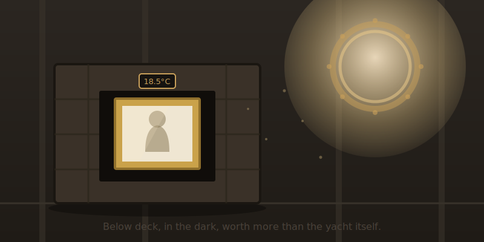
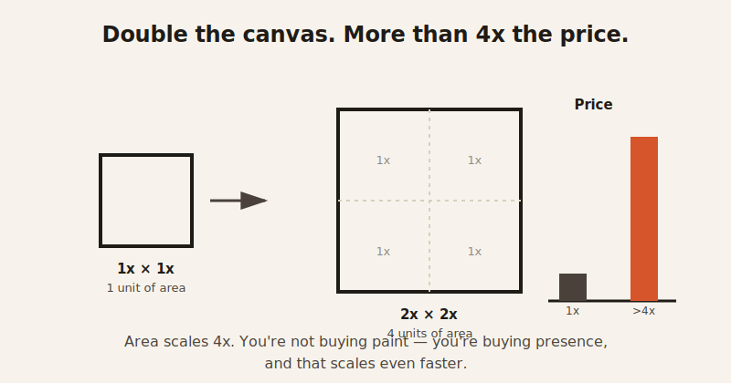

import CompareCard from '../../components/CompareCard.astro';

In 2017, somebody paid $450.3 million for a painting that the museum which tested it won't say is real.

The painting is *Salvator Mundi*, attributed to Leonardo da Vinci. The buyer was Saudi Crown Prince Mohammed bin Salman. Since the sale, it has lived in storage on his yacht. It has never been shown to the public. He wanted to loan it to the Louvre Abu Dhabi — but the Louvre in Paris, the museum that ran the scientific testing on it, refused to display it, because its own scientists couldn't confirm the whole thing was actually painted by Leonardo. So the most expensive painting ever sold sits in a crate at sea, too valuable to ignore and too uncertain to hang.

That should be a contradiction. It isn't. It's just how painting prices actually work.

## So what's actually driving the price?

A painting isn't priced like a car or a phone, where you can point at features and add them up. It's priced on a handful of factors that have almost nothing to do with how good the painting looks up close.

<CompareCard
  rows={[
    { term: "Reputation", meaning: "The same skill under an unknown name sells for pocket change. Under a famous name, it sells for millions." },
    { term: "Scarcity", meaning: "Fewer surviving works by an artist means each remaining one is rarer — and pricier. Death makes the supply permanent." },
    { term: "Provenance", meaning: "Who owned it before you is worth real money. A famous past owner adds a price premium the painting itself didn't earn." },
    { term: "Size", meaning: "Bigger costs more, but not in a straight line — a canvas twice as wide and twice as tall can cost far more than 4x as much." },
    { term: "Authentication", meaning: "Not a yes/no gate. Doubt about who really painted it can lower the price without killing the sale." },
  ]}
  caption="None of these describe how the painting looks. All of them describe its story."
/>

Two of those — provenance and authentication — are worth slowing down on, because they're the two that feel the least like normal economics.

## Provenance: a $100 million paper trail

*Provenance* just means: who owned this before you, on paper, going back as far as anyone can prove. It sounds like a formality. It moves more money than the paint does.

Picasso's *Women of Algiers (Version O)* sold for $179.4 million at Christie's in May 2015, bought by Hamad bin Jassim bin Jaber Al Thani, the former Qatari prime minister. It had just taken the record from Francis Bacon's *Three Studies of Lucian Freud*, which sold for $142.4 million in 2013. Two years later, Salvator Mundi passed both of them.

Or take Modigliani's *Reclining Nude (On Her Left Side)*, from 1917. Irish horse breeder John Magnier bought it in 2003 for $26.9 million. He sold it in 2018 for $157.2 million — a 5.8x return over 15 years, and over $100 million in profit, without the painting itself changing at all. The paint didn't get better. The ownership history got longer, and the market around that history got hotter. That's the whole trade.

## Authentication doesn't have an off switch

Here's where it gets strange. You'd assume a painting either is or isn't a real Leonardo, and the price follows that yes-or-no answer. It doesn't work that way. Authentication behaves more like a dial than a switch.

The Louvre's own scientists examined Salvator Mundi and concluded Leonardo "only contributed" to parts of it — not the whole painting. Some independent researchers go further, arguing Leonardo may have painted just the head and shoulders, with the hands and arms added centuries later by someone else entirely. None of that stopped the $450.3 million sale. It just sat underneath it, as a permanent asterisk. The doubt didn't kill the price. It just followed the painting around afterward, all the way onto that yacht.

Size plays by similarly non-straight-line rules. Canvas area doesn't scale in a straight line with price — a painting twice as wide and twice as tall can cost far more than 4x as much, because you're not just buying more paint, you're buying more of the presence that made the smaller version desirable in the first place.

## It's basically a trading card market, minus the fun part

Strip away the auction-house language and this is a very old game: rare thing, famous owner, unverifiable backstory, wildly inflated price. A Mark Rothko sold privately for $186 million — for a large rectangle of solid color. Hang it in a normal living room and, if you're being honest, it looks a lot like a coat of contractor primer. The value isn't in what's on the wall. It's in everything the five factors above are actually measuring.

And it gets murkier the closer you look. The former director of the Metropolitan Museum of Art has estimated that around 40% of the art on the market is fake — not disputed, not uncertain, deliberately forged. The market keeps moving anyway, the same way you'd keep shopping at a store if you'd heard 4 out of every 10 items might be counterfeit, as long as the receipt looked convincing enough.

Even the freshest paint isn't safe from speculation. Sales of "wet paint" works — pieces resold within two years of being made — jumped from 478 in 2021 to 1,033 in 2022, a 116% increase. Works by artists under 45 more than doubled in the same window, from 279 to 700. Zoom out further and the annual sales value of this kind of ultra-fresh, ultra-contemporary art went from $22.8 million in 2012 to $257.4 million in 2021 — a tenfold jump in a decade. People are buying paintings before the paint has finished drying and flipping them like sneakers off a shelf. The artists who made the work usually see none of that upside — their early prices get set low by galleries just to get the work into "good" collections, and by the time speculators are reselling it for five to ten times as much, the artist is just watching from outside the sale.

Which brings it back to the yacht. Somewhere off a coastline, there's a painting worth more than most private jets, sitting in the dark, examined by the one institution qualified to vouch for it — which looked at it and decided not to.
