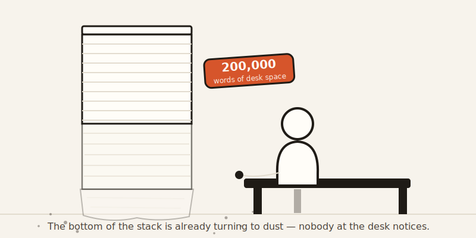
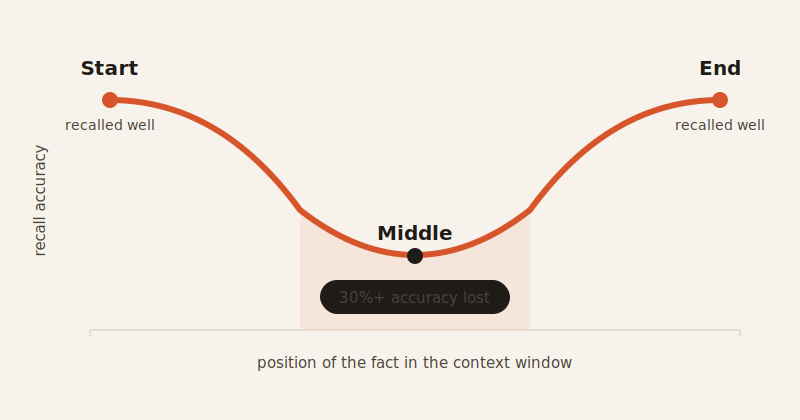

import CompareCard from '../../components/CompareCard.astro';

An AI can be sold on a 200,000-word memory and still only use about half of it well — and it will never once tell you which half.

## The scientist who broke its own brain

Picture an AI agent whose job is to search for molecules with matching electronic structures. It calls a tool to help. The tool hands back a single result: a 3D grid of numbers, 128 by 128 by 128 of them. That's over two million individual values, all at once, all in one answer.

The agent can't hold that. No AI available today can hold that in a single response. The task doesn't fail with an error message. It just stalls, because the one thing the agent needed to look at was too big to look at.

That's context windows in one story: a hard ceiling on how much an AI can hold in its head at once, and no fire alarm when it's exceeded.

## What a "context window" actually is

Every AI has one. It's the maximum number of tokens — small chunks of text, sometimes a whole word, sometimes just a piece of one — that fits into a single conversation. For simplicity, this piece counts them as words. Your question, the AI's earlier answers, any documents you pasted, any tool results it fetched: all of it shares that same limited space.

Go over the limit, and content doesn't get flagged or rejected. It gets truncated or dropped, quietly, and the AI keeps talking as if nothing happened.

Think of it like a worker with a flawless memory, but only exactly 200,000 words of desk space to keep it on. Hand her a briefing, a report, a stack of emails — she'll use every one of them perfectly, right up until word 200,001 arrives. The instant it does, the very first word she ever read vanishes. Not fuzzy. Not "hard to recall." Gone. She doesn't notice it's missing, and she'll keep making decisions as if she still has it.

## Why the limit exists at all

The reason isn't an arbitrary rule someone picked. It's math.

Every time the AI reads, it compares every single word in the conversation against every other word, to work out what matters to what. That's not one comparison per word — it's every word against every other word. Double the length of the conversation, and you don't double that workload. You roughly quadruple it. A 128,000-word conversation already means something like 16 billion of these word-to-word comparisons happening behind the scenes.

That's why context windows can't just be made infinitely bigger. The cost doesn't grow in a straight line — it grows in a curve that gets steep fast.

## The part that should worry you more: the middle goes fuzzy first

Here's the part that catches people off guard. It's not just about running out of room. Even *inside* the window, before anything gets dropped, not every word gets remembered equally well.

Researchers have found AI accuracy forms a U-shape across a conversation. The beginning is remembered well. The end is remembered well. The middle — the 70 to 80% of a conversation that isn't right at either edge — can see accuracy drop 20 to 30%.

So the number printed on the box isn't the number you actually get to use. An AI advertised with a 200,000-word memory realistically behaves well for something closer to half that, because the middle portion is working at a discount the whole time. And most tools built on top of these AIs don't warn you about it. A developer can believe they're using the full 200,000 while the AI is effectively only working with about 100,000 of it properly.

## It shows up in real, working software

This isn't just a lab curiosity. One developer spent six months testing this directly on a large real-world codebase — over 50,000 lines of code, 15 separate refactoring tasks.

With a large context window (150,000–200,000 words used), the AI updated every reference correctly, 100% of the time. Shrink that same window down to 64,000 words, and accuracy dropped to 85–90% — and the work needed two or three extra correction passes to fix what the AI got wrong the first time.

Same AI. Same kind of task. The only thing that changed was how much of its memory was in play — and how much of that memory was sitting in the "fuzzy middle."

## What it feels like from the outside

Ever worked with an AI on a big project — six or eight files, more than fifty back-and-forth messages, over an hour of work — and had it suddenly act like you never told it something? That's this. An hour of active back-and-forth can easily burn through tens of thousands of words of context, and once the older instructions drift into that fuzzy middle zone (or fall off the edge entirely), they stop functioning like instructions at all.

The AI won't say "I've lost track of what you told me earlier." It'll just quietly stop following it.

<CompareCard
  caption="What you're told the memory is, versus what it actually behaves like."
  rows={[
    { term: "What's advertised", meaning: "One clean number — the full context window" },
    { term: "What actually happens", meaning: "The edges work well; the middle quietly underperforms" },
    { term: "When it overflows", meaning: "Old content is dropped or cut, with no warning shown" },
    { term: "What the AI does about it", meaning: "Nothing — it answers confidently either way" },
  ]}
/>

## Two ways it goes wrong that nobody warns you about

**It can even run out of room on its own answer.** An agent can make a perfectly sensible decision that happens to require a long response — say, 250,000 words worth. If that overshoots the window, the whole request can fail outright, mid-thought, for a reason that has nothing to do with whether the decision itself was any good.

**Nobody can eyeball how full a memory is, including the AI.** Word counts don't even mean the same thing across different AI models — the exact same sentence can chop up into meaningfully different numbers of tokens depending on which model is counting, sometimes by 10 to 15%. So even a careful developer keeping a rough tally in their head can be working off the wrong math entirely.

And one detail that trips people up: caching a conversation to save money doesn't shrink it. Whether content is freshly typed or pulled from a cheaper cache, it still occupies the same space in the window. Cheaper isn't the same as smaller.

## The short version

A context window is not a filing cabinet. It's a desk with a fixed size, where even the papers still on the desk get read less carefully the further they sit from either edge — and the AI never once says so out loud. Bigger numbers on a spec sheet help. They just don't help nearly as much as they look like they should.
