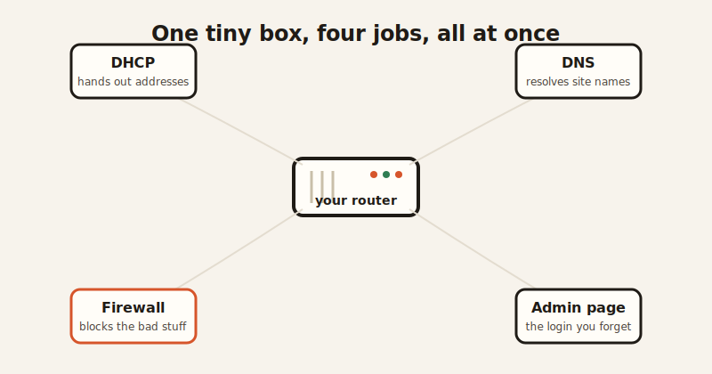

import CompareCard from '../../components/CompareCard.astro';

Somewhere in your house, there's a computer with less storage than a single low-res photo, and it's been running an operating system, nonstop, for years, without you ever once opening a lid or seeing a screen.

## It's not an appliance. It's a computer.

Open up a Wi-Fi router and you don't find a black box of magic. You find a CPU, some RAM, a chunk of flash storage, and a wireless chip — the same basic recipe as any computer, just shrunk down. It boots a real Linux kernel and a real set of Linux command-line tools (GNU userland, if you want the technical name), the same foundational software you'd find running underneath servers across the internet.

A 2010 TP-Link router has 8MB of flash storage. A modern iPhone has 128GB. That's a 16,000-times difference — and the router still runs a full, multitasking operating system inside that 8MB, not a stripped-down toy version of one.

Storage isn't the only thing that's tiny. A budget model on shelves right now, the TP-Link TL-WR850N v3, runs a 575MHz processor with just 32MB of RAM and 4MB of flash storage. That's the entire computer — CPU, memory, and storage — smaller than a single podcast episode.

<CompareCard
  caption="Same species of computer. Wildly different diet."
  rows={[
    { term: "What it runs", meaning: "Full Linux kernel + GNU command-line tools" },
    { term: "TP-Link TL-WR850N v3 (current)", meaning: "575MHz CPU · 32MB RAM · 4MB flash storage" },
    { term: "2010 TP-Link router flash", meaning: "8MB — versus 128GB on a modern iPhone" },
    { term: "What's happening on it", meaning: "DHCP server, DNS resolver, firewall, web server — all at once" },
  ]}
/>

## You can SSH into it, like any other server

Here's the part that surprises people who've used Linux servers before: you can log into most routers exactly the way you'd log into a rented server somewhere in a data center. Type `ssh root@192.168.1.1`, enter the password, and you're staring at a real command prompt — `grep`, `sed`, `awk`, `ps`, all the familiar tools, running on the box sitting three feet from your couch.

That's not a router pretending to be a computer. That *is* a computer, doing router duty. While you're using it for Wi-Fi, it's simultaneously acting as a DHCP server (handing out addresses to every device that joins your network), a DNS resolver (translating website names into numbers), a firewall, and a web server — that admin login page you visit once a year and instantly forget the password to. All of that, running at the same time, on hardware smaller than a paperback.

## People turn these things into tiny servers on purpose

Because it's just Linux under the hood, hobbyists don't stop at "it does Wi-Fi." A project called OpenWrt — free, open-source router software — supports around 2,000 different router models and lets people install extra software on them: a file-sharing server, an FTP server, a VPN, even ad-blocking at the network level. People run all of that on the same 32MB of RAM the manufacturer insists is "only" enough for Wi-Fi and DHCP. It's the original home NAS box, and most owners have no idea the hardware in their closet is capable of it.

OpenWrt itself has a slightly absurd origin story. In 2003, Linksys released the source code for its WRT54G router — not out of generosity, but because the software was built on Linux, and Linux's license legally required them to share it. A licensing technicality accidentally kicked off an entire open-source router movement. Nobody planned that. It just happened because somebody read the fine print.

## The part that isn't funny at all

Here's the catch, and it's a real one: most routers never get their operating system updated, ever. Many Broadcom-based routers — including popular ASUS and Netgear models — still run Linux kernel 2.6.36, a version that reached its official end of life back in February 2016. No more security patches, for a kernel sitting on a device connected straight to the internet, 24 hours a day. Even newer ASUS models running kernel 4.1.x are five-plus years old and built on custom branches Broadcom no longer officially supports.

That combination — old software nobody patches, plus factory-default passwords nobody changes — is exactly what botnets are built to find. Mirai-based malware scans the internet for routers, then simply tries 62 common default logins (`admin`/`admin`, `root`/`12345`, that kind of thing) over an old remote-access protocol called Telnet. No clever hacking required. It works because it doesn't need to be clever — millions of routers were left exactly as they shipped. Recent variants are still doing this in the wild, targeting newly discovered flaws in outdated Linux-based router firmware.

So the same fact that makes routers charming — a real, hackable, full-blown Linux computer in your closet — is the fact that makes them a target. It's a tiny server nobody remembers to maintain, sitting on the front door of the network.

## The one line worth remembering

Next time the Wi-Fi blinks at you from the shelf, that's not a dumb box. It's a full Linux computer, running the same kind of software as a server, crammed into less storage than a text message thread — old, under-maintained, and doing four jobs at once without complaint. Respect the box. Just maybe also change its password.
